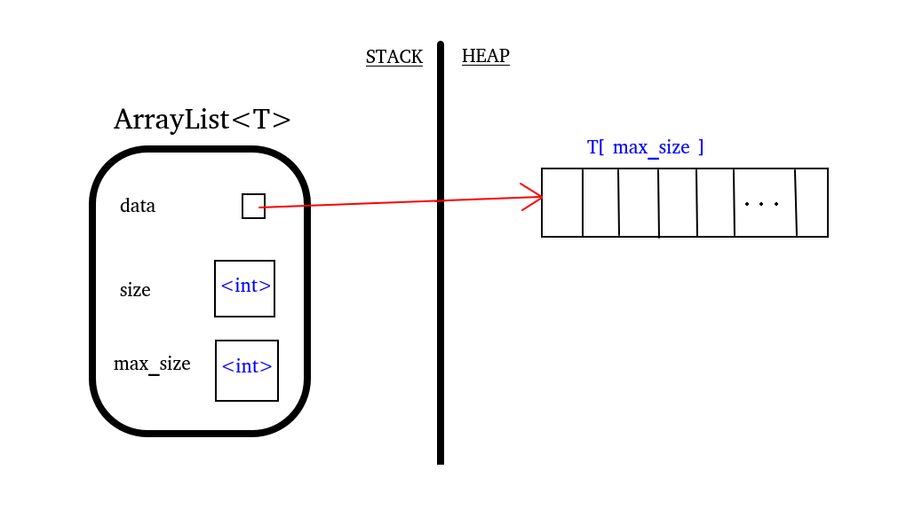

# ArrayList Class & Diagram

[[examples/arraylist-class]]
<!-- #include [[examples/arraylist-class]] -->
```c++
#define MIN_CAPACITY 8
template <typename T>
class ArrayList
{
  private:
    int size;       // # of elements currently stored
    int max_size;   // length of storage array
    T *data;        // pointer to storage array
    void resize(int new_max_size);
  public:
    ArrayList() : size (0), max_size (MIN_CAPACITY) 
                { data = new T[max]; } // default constructor

    //OPERATIONS
    T & operator[](int i);
    void insert(int i, const T& x);
    void erase(int i);
    bool find(const T& x);
    // ... 
};
```
<!-- /include -->




---

# Operations (member functions)

## Size

```c++
template <typename T>
int ArrayList<T>::size()
{
  return size;
}

myArrayList.size();
```


## Get/Set

In C++ classes, Get & Set can be bundled together!


<!-- #include [[examples/arraylist-bracket-op]] -->
```c++
template <typename T>
T & ArrayList<T>::operator[](int i)
{
  // warning! no bounds-checking performed
  return data[i];
}
<!-- /include -->

## Resize (Auxiliary Function)

[[examples/arraylist-resize]]


## Insert

[[examples/arraylist-insert]]

## Remove

[[examples/arraylist-remove]]

## Find

[[examples/arraylist-find]]


---

# Default Member Functions

## Destructor

[[examples/arraylist-destructor]]

## Operator=

[[examples/arraylist-assign-op]]

## Copy Constructor

[[examples/arraylist-copy-constructor]]