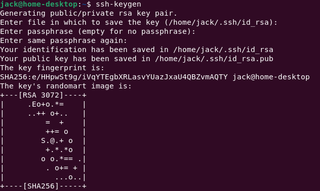
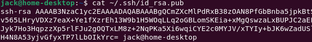
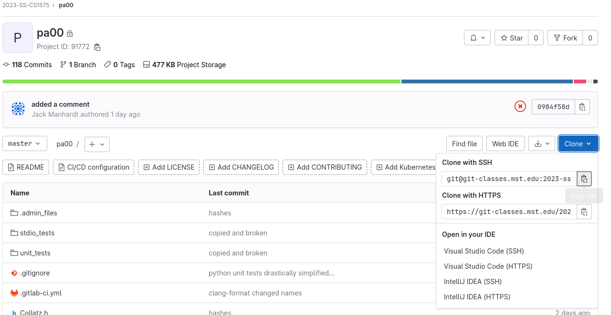
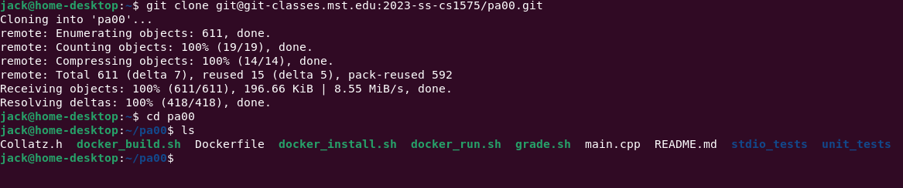
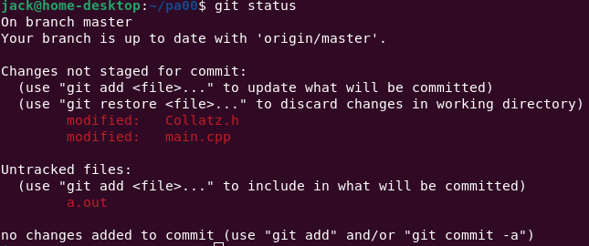
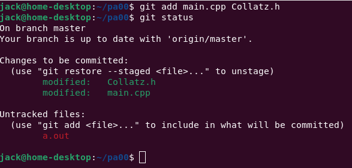
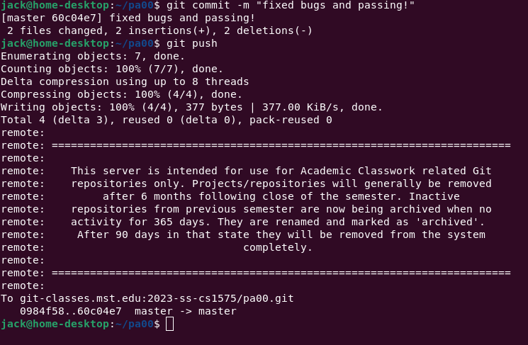

This is a quick-and-dirty tutorial to get you started on your assignments. Those of you in CS1585 will get more familiar with this workflow and the tools involved.

**note:** you will first need access to a Linux operating system and _sudo_ rights. See [[Dev Environment]] if you haven’t already

## How to obtain an SSH key

An SSH key is an important security measure for your git-classes account. You’ll need one to start and submit your homework to https://git-classes.mst.edu

Start by opening a terminal, and run the command ```ssh-keygen```. The default options are fine for now.



If you chose the default options, you can view your key with the command ```cat ~/.ssh/id_rsa.pub```



Copy the entire key and add it to your git-classes account
  **(Top Right) -> Edit Profile -> SSH Keys**

In-depth tutorial for this step [here](https://git-classes.mst.edu/help/user/ssh.md)

## How to start your assignment

Once you have your SSH key added, the next step is to clone the repository. Navigate to the assignment at git-classes and copy the link found via **Clone -> Clone with SSH**



Now in your terminal, run the command ```git clone <paste link here>```. If all goes well, you’ll now have a folder containing all the relevant files for the assignment. If this step fails, you can try installing Git with ```sudo apt install git``` (on Ubuntu/Debian, the command may differ for other Linux distributions) or refer to the section above.



You can now start working on your code!

---
## How to check your progress

Simply execute the ```grade.sh``` script in your terminal and follow the interactive instructions to receive feedback on your work. At the end you’ll be given a score, this is what you can actually expect to receive on the assignment!

You may have to install some dependencies, so just follow the on-screen instructions if this step is not working. Below is a breakdown of the various tests your code is put through and how to interpret the results.

### unit_tests

These tests focus on specific parts of your code. The key idea is that the smaller the test, the easier it is to identify the root of the problem. 

The order of these tests is not arbitrary! It’s **Strongly Recommended** that you tackle them one at a time before moving onto the next, and complete each of them before moving onto stdio_tests.

[[Using a Debugger]]

### stdio_tests

stdio is short for “Standard Input/Output”. These tests look at the behavior of your program as a whole, which can identify errors in main() logic, I/O-formatting, or edge cases not caught by the unit tests.

### static analysis

This section will _attempt_ to automatically identify potential problems with your code. It is a good idea to pay attention to the warnings in this section, as understanding and fixing them will help identify bugs in your assignments and improve your skills as a C++ programmer.

### style check

Life’s too short to argue about 80 character line limits or if ‘{‘ should go at the end of a line or on it’s own. Oh the horrors, however, if we let everyone format as they please with no consistency whatsoever (especially in the whitespace wild-wild-west of C++ 🤠).

Auto-formatting tools have long since solved this problem, here’s how you can get points for this section. Simply write your code in whatever style is comfortable for you, then use the ```clang-format``` utility prior to submission.

**example:** ```clang-format -i main.cpp```

You may have to install clang-format first (```sudo apt install clang-format```) for Ubuntu/Debian

---
## How to submit your assignment

Once you are ready to submit, follow these steps. You can do this as many times as you wish before the due date.

Start by running the command ```git status``` , you should see a listing of files that you have modified in red.



For the files containing your code, enter the command ```git add <name of file> <name of another file>```. Now when you run ```git status``` they will be marked in green.



Finish by running the command ```git commit -m “<describe your changes>“``` Followed by ```git push```. If you’ve done everything correctly, you should now see your completed assignment in git-classes.



**Notes:**
* Do not create any additional files, use the files provided
* You may create additional functions if you wish, but all assigned functions must operate as specified for full points
* Unless otherwise stated, **do not** use any libraries that aren’t included in the assignment to begin with
