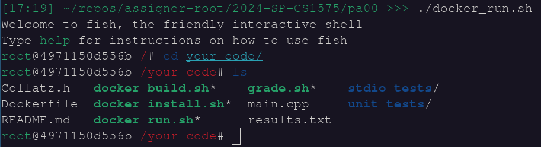

This page will walk you through some options for setting up your development environment. You must have a Linux environment that you control (the campus Linux machines accessible through SSH/Putty are not sufficient)

# Option 1: Personal Linux Installation

If you are already using a Linux-based operating system on your personal device, then you may use that. The assignments should be compatible with most common Linux distributions, but will require some software packages for which availability may differ.

If you choose this option, you are responsible for obtaining all required packages. See the section on Docker below to help ensure compatibility with minimal configuration.

# Option 2: Linux Virtual Machine

For many students, a virtual machine (VM) will be the preferred option. This will allow you to emulate a Linux machine on your device regardless of your native operating system. A VM also provides a safe _sandbox_ environment for you to experiment in, which is ideal for Linux beginners.

_For this option, you will need to install [VirtualBox](https://www.virtualbox.org/)_

## For Students Taking CS 1585

CS 1585 requires setup and makes heavy use of a linux VM. If you are taking or have taken this course, then you should be able to use that environment for CS 1575 as well.

Assuming you have set up a Debian VM, you can run the following commands to install all 1575-specific packages:

```bash
$ sudo apt-get install cmake python3-levenshtein clang-format valgrind pipx

$ python3 -m pipx ensurepath
$ pipx install valgreen
```

## Pre-made VM for non-1585 Students

A ready-made course VM is available for download [here](https://drive.google.com/file/d/1C1C919EU_jeohhL8vL6nTTiaOvPcafdA/view?usp=sharing)

First make sure that you have VirtualBox installed, then follow the steps below to import the VM:


**Select the downloaded OVA file in the step below**


**Take the time to adjust the settings below to the recommended (green) amount for your computer**


**You can now start the VM and begin working**

Default user/password: classVM/cs1575

_Note: CS 1585 students are required to set-up their own VM. If you have not completed the lab on virtual machines, do not simply import this one or you will risk getting no points for that assignment_

---
# Option 3: Docker

[Docker](https://www.docker.com/) is a tool that allows you to deploy a customized OS environment with no installation required. Provided inside the assignment repository is a _Dockerfile_ which will allow you to deploy and interact with the exact environment that your code will be graded in. This can be helpful if you do not wish to or cannot install the required packages.

Experienced MacOS or WSL users may use this Dockerfile to complete the assignments if they wish, but this process is still experimental and not officially supported yet. It is highly recommended that you set up a Linux VM even if you intend to try using Docker.

### For MacOS users:

The class VM may experience difficulties when run on a MacOS device. In this case, you can use docker to work the assignment.

You will first need to [install git](https://git-scm.com/download/mac). After which, you can follow the steps in the [[Assignment Tutorial]] to get a copy of the assignment on your personal device.

Inside the assignment folder, 3 scripts are provided:
  _docker_install.sh, docker_build.sh, docker_run.sh_

Execute each of these in order, following the instructions to install docker and create a Linux container. Once successful, you will have terminal access to a Linux environment where you can run the auto-grader, complete your code and submit your assignment.

These scripts will also create a shared folder between the Linux environment and your personal device, which you can utilize to edit the code using whatever tools you like.

_Shown: how to navigate to the shared folder_

Any changes made to files in the **your_code/** directory (in the docker container) will be reflected in the files in the assignment folder (on your device). Git-actions (git push / git pull) will not work inside **your_code/**, however, unless you configure a SSH-key/personal-access-token for each assignment.

The suggested workflow is to use your own device to edit and submit code, but use the docker container to run the autograder and check progress.

# Option 4: Mill-Classes

This option will allow you to work on your assignments from any browser by accessing the _Mill_ (a section of S&T’s high-performance computing cluster). This option will require an active mill account which depends on you being currently enrolled in a course that needs it.

Start by navigating to https://mill-classes.mst.edu
* If you receive an error, contact your instructor to make sure you have been added to the appropriate net-group for the course
* If this is your first time using the Mill, request an account and wait to be approved by the IT department

Once there, select the **Mill Desktop** option and start a session.
* If the session expires, you will be kicked off and have to start a new session. If this happens, any _saved_ files will still be there when you return but you **may lose any unsaved code**
* _VS-Code_ power-users are welcome to create a VS-Code session instead, but this option is not officially supported and you are responsible for making the standard assignment instructions work with this method

This desktop environment is under the supervision of the IT RSS team, and may not have all of the software packages needed for our assignments. We therefore need to use a _container_ to get access to the required software without installing it locally.

Open a terminal and run the following commands:

* echo "alias cs1575=\"apptainer shell /mnt/stor/ceph/cs_class/cs1575/fedora_container.sif\"“ >> ~/.bashrc
* source ~/.bashrc

Now type the command ```cs1575```. If successful, you should see the word ```Apptainer>``` at the prompt of your terminal. Run this command whenever you need to use the course auto-grader and it will work until the terminal is closed.