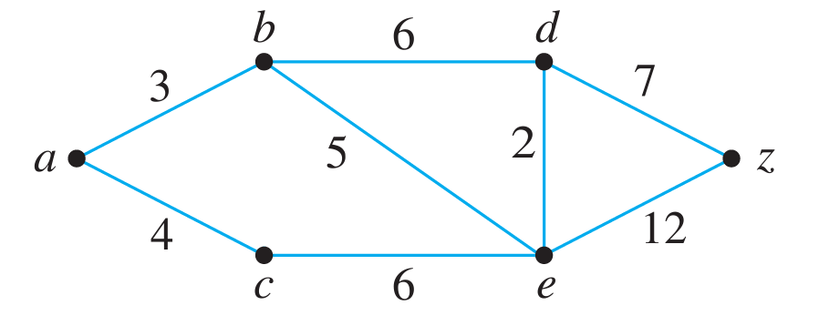
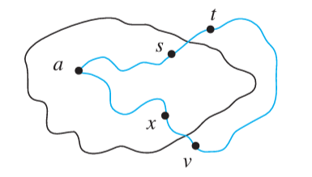

# Concept & Algorithm

This algorithm for computing the shortest path between vertices in a weighted graph is credited to Edsgar Dikjstra in 1959.

The general idea behind the algorithm is very similar to _Prim’s Algorithm_ for computing a _Minimum Spanning Tree_. 

To compute the shortest path from vertex **a** to vertex **z**, begin with only the starting vertex **a** and iteratively build a tree **T** outward until the ending vertex **z** is reached.

At each iteration, the candidate vertices to add are those that are _adjacent_ to some vertex already in **T**. Unlike _Prim’s_, where the one chosen is the one with the lowest edge weight, _Dikjstra’s_ selects the vertex which is **the shortest total distance** from the starting point **a**.

---
Let **G** be a connected simple graph with positive weights for each edge
Let **w(u,v)** represent the weight of the edge from **u** to **v**
Let the starting vertex be **a** and the ending vertex be **z**

Let **L(x)** represent the current _best-estimate_ of the _length_ of the shortest path from vertex **a** to vertex **x**. 
Initially, **L(a) = 0** and **L(x) = ♾** for all other vertices. These values will be updated as the algorithm is executed

Let **T** be a tree _subgraph_ of **G** to be maintained as the algorithm executes. Initially, **V(T) = {a}** and **E(T) = {}**

Let **F** be the set of all _fringe/candidate vertices_ that are under consideration to be added to **T**

Let **B(x)** represent the vertex that would come _before_ vertex **x** in the shortest path computed. Since **T** may include more edges than necessary, these values can be used to list the vertices on the shortest path in order when the algorithm is finished

```
update-length(current_v, candidate_v):
  if ( L(current_v) + w(current_v,candidate_v) < L(candidate_v) ):
    L(candidate_v) := L(current_v) + w(current_v, candidate_v)
    B(candidate_v) := current_v
```

```
Dikjstra(G, a, z):

  Initialize:
    V(T) = {a}
    E(T) = {}
    F = {a}
    v = a
  
  while (z not in V(T)):
    remove v from F
    let C := {all vertices of G adjacent to v and not in V(T)}
  
    for each vertex u in C:
      add u to F
      update-length(v, u)
  
    let x := the vertex in F where L(x) is minimal
    add x to V(T)
    add {B(x), x} to E(T)
    v := x
```


---

# Tracing Example

https://www.cs.usfca.edu/~galles/visualization/Dijkstra.html



# Proof of Correctness

We can ensure that Dikjstra’s algorithm will always produce the shortest path by following a proof by _induction_

---
Let **G** be a connected simple graph with positive edge weights
Let **T** be the _subgraph_ constructed by Dikjstra’s algorithm
Let **L(u)** be the estimated length from **a** to **u** defined above

For integers **n >= 0**, let the predicate **P(n)** be defined as:

  **P(n) :=** After the **n**-th iteration of the loop, 
          1. **T** is a tree
          2. For every vertex **v** in **V(T)**, **L(v)** is the length of the shortest possible path in **G** from **a** to **v**

_**Note:**_ For most of our inductive proofs, we have considered a domain of {s, s+1, s+2, ...} where **s** is some starting integer. In this proof, we consider a domain of {0, 1, ..., N} where **N** is the (unknown) total number of iterations required in the range of **0** < **N** < **|V(G)|**

**Basis Step:**

To show that **P(0)** is _true_,

1. **V(T)** = **{a}** and a single vertex is defined to be a _tree_ 
2. **L(a)** = **0** and the length of a path from any vertex to itself is trivially **0**
   
**Inductive Step:**

  _Inductive Hypothesis:_ Suppose **k** is any positive integer such that **P(k)** is true.
We shall demonstrate that **P(k+1)** must also be true. 

In other words, we suppose that after the **k-th** iteration, **T** is a tree and **L(y)** is the shortest length from **a** to **y** for all **y** in **V(T)**. We will show that after the **k+1-th** iteration, **T** is still a tree and **L(v)** is the shortest length for the newly added vertex **v**

  _**T is a tree after k+1**_:
Since Dikjstra’s only considers candidate vertices that are _not_ already in **T**, the addition of a new vertex in **k+1** cannot create a circuit. Furthermore, the addition of a new vertex + edge can never disconnect a previously connected graph.

Therefore, since **T** is a tree after **k** by the inductive hypothesis, **T** will also be a tree after **k+1**

  **_L(v) is the shortest path length for all v after k+1_**

By the inductive hypothesis, prior to **k+1**, **L(y)** is the shortest path length for all **y** in **V(T)**. Since these length values never change once a vertex is added to **T**, it remains to show that following **k+1**, **L(v)** is the shortest path length for the newly added vertex **v**

Consider the scenario depicted below where **v** has been selected as the newly added vertex in **k+1**. The question that we must consider is:

  _How can we ensure that the estimated length L(v) is now in fact the shortest possible among all paths from **a** to **v**_? 
  
Let **LSP(a,v)** be the length of a shortest path from **a** to **v**, which may or may not be **{a,x,v}**. We can consider instead the case where **t** is on a shortest path from **a** to **v**

We want to prove that **LSP(a,v) = L(x) + w(x,v)**



From the figure, we can reason that **LSP(a,v) >= LSP(a,s) + w(s,t)**, as the path from **t** to **v** contributes some positive length.

By the inductive hypothesis, we can also reason that **LSP(a,s) + w(s,t) = L(s) + w(s,t)** as **s** is a vertex in **T**.

Furthermore, we know that **L(s) + w(s,t) >= L(x) + w(x,v)** because that was the basis on which **v** was selected to be the next vertex. If it were not true, then **t** would have been selected instead.

Summarizing this logic, we have proven:

  **LSP(a,v) >= LSP(a,s) + w(s,t) >= L(s) + w(s,t) >= L(x) + w(x,v)**

or succinctly:

  **LSP(a,v) >= L(x) + w(x,v)**

Finally, by the definition of **LSP(a,v)**, we have that:

  **LSP(a,v) <= L(x) + w(x,v)**

as the right-hand side represents the length of a path from **a** to **v**.
From the two results above, we can complete the proof of the inductive step

  **LSP(a,v) = L(x) + w(x,v)**

Note that the same logical argument applies to _any_ competing path from **a** to **v** in _any_ graph **G**

Thus, by the principle of mathematical induction, **P(n)** must be true for all iterations **n >= 0**. Therefore, once the ending vertex **z** is added to **T**, the algorithm will always have computed the shortest path from **a** to **z**

---