## Euler Circuits & Trails

#Definition An **Euler circuit** is a _circuit_ that includes every _vertex_ at least once and includes every _edge_ exactly once

_example:_ **The Seven Bridges of Konigsberg**

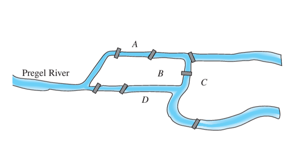
Behold the very first _Graph_. Legendary mathematician _Leonhard Euler_ was walking the streets of Konigsberg, Prussia one day and considered the following question:

  _Is it possible to walk around the city, crossing each bridge exactly once, and end up in the same place you started_?

To answer this question, Euler decided to represent the city as a set of points for each of the land-masses and a set of edges for each of the seven bridges. This was a concept that did not yet exist in mathematics!

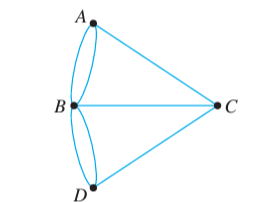
Euler’s paper analyzing the problem went on to spark the entire field of _Graph Theory_, and the seminal problem he considered came to be known as an _Euler Circuit_

#DiscussionQuestion If you were Euler, what would your conclusion be? Does an _Euler circuit_ exist for the graph of Konigsberg?

#Theorem If a graph **G** has an _Euler circuit_, then every element of **V(G)** must have an even, positive _degree_.

#DiscussionQuestion What does the above theorem say about graphs with a vertex of odd degree?

#Definition An **Euler trail** from **v** to **w** (where **v** and **w** must be _distinct_) is a _trail_ that includes every _vertex_ at least once and includes every _edge_ exactly once.

#Theorem An **Euler trail** from **v** to **w** exists if **G** is _connected_, **v** and **w** are of odd _degree_, and every other vertex (**V(G) - {v,w}**) is of positive, even _degree_

_example:_

Consider the floor-plan below:

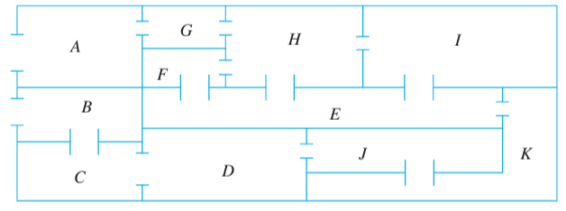
Is it possible to visit every room of the house using every door exactly once?

To consider this as a graph problem, convert to a _graph representation_ where the rooms are _vertices_ and doors are _edges_

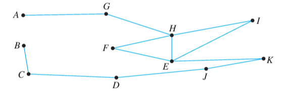

The question then becomes: **Does the graph above have an Euler trail?**

---
## Hamiltonian Circuits

#Definition A **Hamiltonian circuit** is a _simple circuit_ that includes every vertex of the graph exactly once.

A more formal definition is listed below:

#Theorem If a graph **G** has a _Hamiltonian circuit_, then there exists a _subgraph_ **H** of **G** with the following properties:
* **H** contains every vertex of **G**
* **H** is connected
* **H** has the same number of _edges_ and _vertices_ (**|V(H)| = |E(H)|**)
* Every _vertex_ of **H** has degree 2

_by Contraposition:_
If no such **H** can be constructed, then **G** has no _Hamiltonian circuit_

#DiscussionQuestion Using the theorem above, prove that the graph shown below DOES NOT have a Hamiltonian circuit

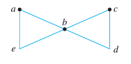

_example:_ **The Traveling Salesman**

A classic problem in computer science, the _traveling salesman_ problem asks:

  _For a collection of houses with known distances between them, what is the quickest way for a door-to-door salesman to visit every house on his/her route (starting and stopping at the salesman’s own house)_

To answer this, one can consider a _weighted-graph representation_ of the problem, and aim to find the _Hamiltonian circuit_ with the least total weight

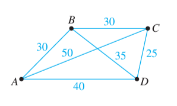
| Possible HC | Total Distance (weight) |
|----------|----------|
| ABCDA | 30 + 30 + 25 + 40 = 125 |
| ABDCA | 30 + 35 + 25 + 50 = 140 |
| ACBDA | 50 + 30 + 35 + 40 = 155 |
| ACDBA | 50 + 25 + 35 + 30 = 140 |
| ADBCA | 40 + 35 + 30 + 50 = 155 |
| ADCBA | 40 + 25 + 30 + 30 = 125 |

Note that this brute-force method of finding every _Hamiltonian circuit_ and calculating the minimum is **VERY SLOW**. 

Finding an efficient algorithm to solve this problem is an open problem in computer science and generally considered impossible. Though many efficient methods of getting an _approximate_ solution have been proposed

---
# Trees

#Definition A graph is **circuit-free** (or **acyclic**) if and only if it contains no _circuits_

#Definition A **tree** is a _connected, acyclic graph_

#Definition A **forest** is an _acyclic_ graph that is not _connected_

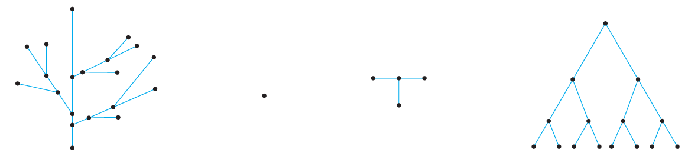

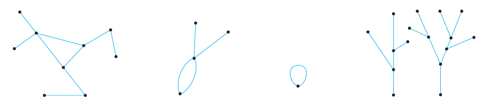

Note that _trees_ cannot have parallel edges or loops, as those always result in a _circuit_. Therefore, all _trees_ are _simple graphs_

#Theorem A simple graph **G** of **n** vertices is a _tree_ if and only if **G** is _connected_ and has exactly **n-1** edges

#ChallengeQuestion Can you give an argument for the theorem above using _Mathematical Induction_?

## Rooted Trees

#Definition A **rooted tree** designates one vertex as the **root**, and characterizes the rest of the vertices relative to the _root_.

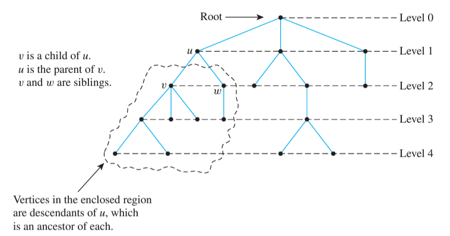

### Binary Trees

#Definition In a **binary tree**, vertices have a parent and a maximum of two children. These children are typically distinguished as the _left-child_ or _right-child_

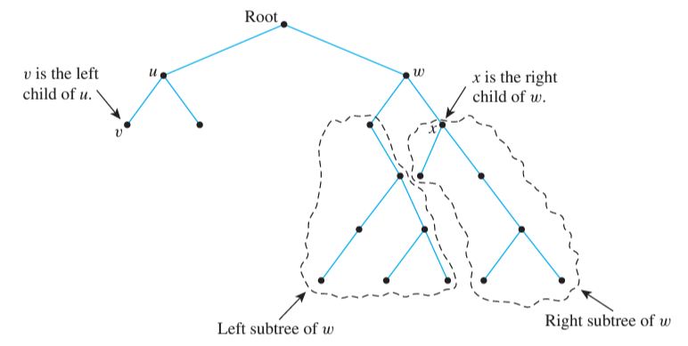

## Applications of Trees

Trees are widely applied to many problems both in and out of computer science. Below are just a few such examples

_Decision Trees_

_Characterizing Hydrocarbon Isomers_

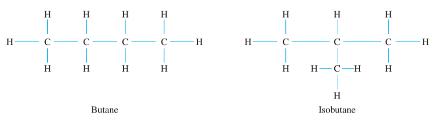

## Spanning Trees

#Definition A **spanning tree** of an undirected graph **G** is a _sub-graph_ of **G** that is both a _tree_ and includes every element of **V(G)**

_example:_ **Railway planning**

Suppose that a shipping company plans to build a series of railroads connecting several major cities. The surveyors have determined the routes that would be possible to build, depicted by edges in the graph below
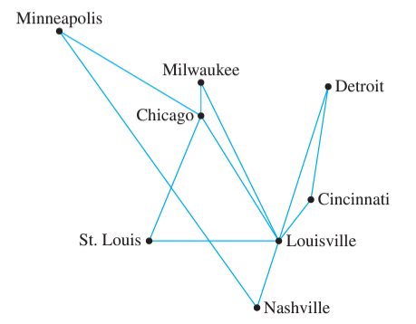

To cut costs, the company wants to ensure that every city is reachable in their rail system using the fewest possible connections.

_Circuits_ are therefore, an unnecessary luxury. The company seeks a _spanning tree_ of the surveyors’ graph 

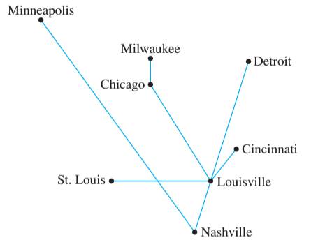

But wait! Shorter rails are cheaper to build than longer ones. To truly minimize costs, the company should find a way to connect all cities using the least total distance 

#Definition A **minimum spanning tree** of a weighted graph is the _spanning tree_ with the lowest total weight

There are several methods of forming a _minimum spanning tree_ efficiently. Two such algorithms are described below:

### Kruskal’s Algorithm

_Kruskal’s Algorithm_ takes a given _connected_ graph **G** and generates a _subgraph_ **H** that is guaranteed to be a _minimum spanning tree_

1. Set **V(H) = V(G)**, **E(H) = { }** to begin
2. Let **n** represent **|V(H)|** and let **m** represent **|E(H)|** (initially, 0)
3. Create set **S = E(G)**
  4. Let **e** be an edge from **S** with the minimal weight
  5. If adding **e** to **E(H)** would _not_ create a circuit, do so
  6. Remove **e** from **S**
7. Repeat steps 4-7 if **m** < **n-1**

### Prim’s Algorithm

_Prim’s Algorithm_ takes a different approach, beginning at an arbitrarily chosen starting node and growing the MST outward from that point

1. Set **V(H)** to any starting vertex **a** in **G** initially
2. Create set **S = V(G) - a**
  3. Locate edge **e** such that
     * **e** has one endpoint in **V(H)** and one endpoint (**b**) in **S**
     * **e** has the minimal weight of all such edges
  4. Add **e** and **b** to **H**
  5. Remove **b** from **S**
6. If **S** is non-empty, repeat steps 3-6 