# Graphs

#Definition A _graph_ **G** consists of two sets:
* A **Vertex Set** (**V(G)**) containing **Vertices/Nodes**
* An **Edge Set** (**E(G)**) relating elements of **V**

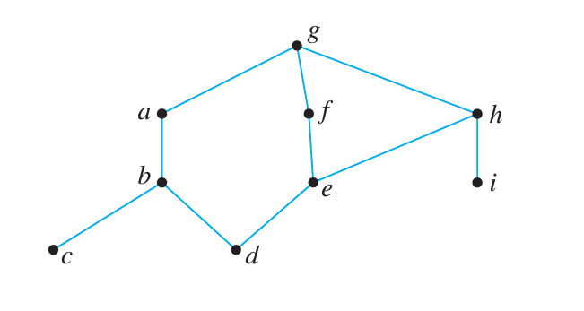
Each **edge** in **E** is associated with two vertices from **V** called **endpoints**

#Definition _graph terminology:_
* An edge **e** with endpoints **{v,w}** is said to be **incident on v** (and _incident on w_)
* Any two _vertices_ that are joined by an _edge_ are said to be **adjacent**
* Edges that share the same endpoints are called **parallel edges**
* An edge of the form _{v, v}_ where _v_ is some vertex is called a **loop**
* A Vertex that is not part of any edges is known as a **isolated vertex**

#DiscussionQuestion Identify any _parallel edges, loops, or isolated vertices_ in the graph below
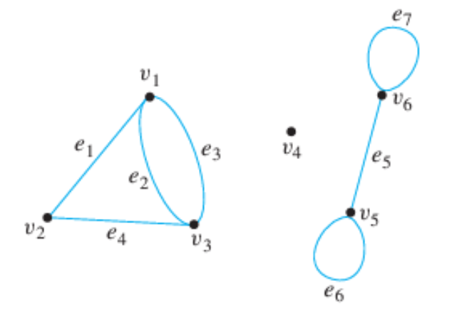
| Edge | Endpoints |
|----------|----------|
| e1 | {v1, v2} |
| e2 | {v1, v3} |
| e3 | {v1, v3} |
| e4 | {v2, v3} |
| e5 | {v5, v6} |
| e6 | {v5, v5} |
| e7 | {v6, v6} |

**Parallel edges:** ?
**Loops:** ?
**Isolated Vertices:** ?

---
#Definition The **degree** of a vertex **v** is the number of edges _incident_ on **v**

For the purposes of degree, a _loop_ **{v,v}** counts as two edges _incident_ on **v**

#Definition The **total degree** of a graph **G** is the sum of the degrees of all elements in **V(G)**

#DiscussionQuestion Consider any arbitrary graph with **|E(G)|** edges. Without drawing **G**, what is its _total degree_?


---
#Definition Given two graphs, **H** and **G**, we say that **H** is a **subgraph of G** if and only if **V(H)** is a subset of **V(G)** and **E(H)** is a subset of **E(G)**

#BoardQuestion Draw all possible _subgraphs_ of the graph below

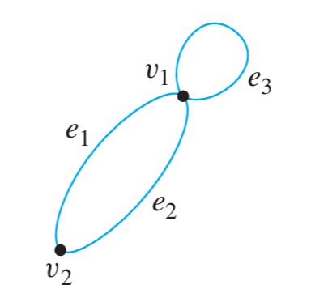

---
## Directed & Weighted Graphs

#Definition In a **directed graph** (or **digraph**), the _edge-set_ _E(G)_ is replaced with a set of _directed edges_, **D(G)**

A _directed edge_, **d**, is associated with an element from **V(G) x V(G)**. That is, an ordered pair **(v,w)** where **v,w** are _vertices_ of **G**. In this case, **d** is the **directed edge from v to w**

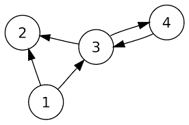

_note:_
In some texts, all edges are directed and _undirected graphs_ are considered a special case where **D(G)** is _symmetric_

---

#Definition In a **weighted graph**, edges are further associated with a real-valued **weight**. 

Since edges are used to represent a relationship between the elements of **V(G)**, this weight can be used to express that some elements are _more related_ or _less related_ than others.

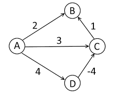


---
# Graph Representations

_What do vertices represent?_ **Anything**
_What do edges represent?_ **A relationship between anything and anything**
_What are graphs used for?_ 🤯 **ANYTHING!** 🤯

Graphs are a powerful tool used to represent any _relationship_ between elements of a set

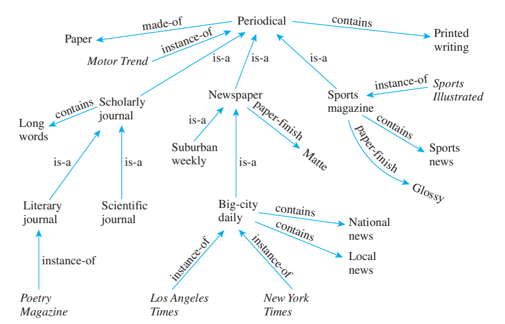

_examples:_
* Communication in computer networks
* Travel-networks / road-systems
* Social networks
* Circuit design
* Outbreak of disease
* Water flow in plumbing systems
* Possible decision-making routes to goal condition

#DiscussionQuestion In the examples above, what would the _vertices_ represent? What would the _edges_ represent?

It’s important to remember for any _graph representation_ that what matters is the _logical relationship_ between vertices and **NOT** the visual depiction of the graph

In other words, a graph **G** is _uniquely identified_ by **V(G)** and **E(G)**

#BoardQuestion Label the vertices and edges in the two graphs below to demonstrate that they are in fact the same graph

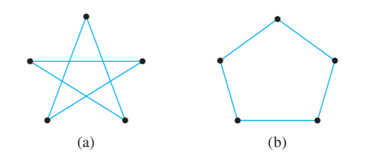

---
# Special Types of Graphs

#Definition A graph containing any parallel edges is referred to as a **multigraph** 

#Definition A **simple graph** is graph with no _loops_ and no _parallel edges_

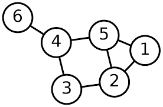
#DiscussionQuestion Do the following graphs exist? Draw an example if so

* A graph with 4 vertices of degree 1,1,2,3
* A graph with 4 vertices of degree 1,1,3,3
* A _simple graph_ with 4 vertices of degree 1,1,3,3

---
#Definition A **complete graph** is one in which there is an edge **(v,w)** for every possible pairing of vertices **v,w**

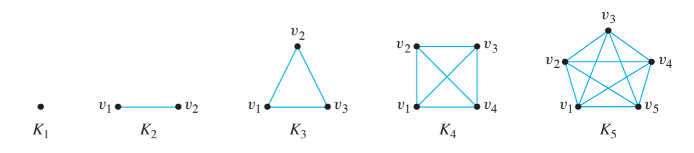

#ChallengeQuestion Can you apply the techniques learned in [[Combinatorics & Probability]] to count the number of _subgraphs_ for a _complete graph_ of **n** vertices?

---
#Definition In a **bipartite graph**, the vertices **V(G)** can be partitioned into two sets **U1, U2** such that no edge connects two elements of **U1** or two elements of **U2**

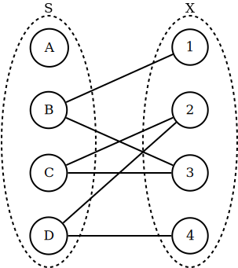


These graphs are often applied to _matching problems_ such as:
* Distributing tasks (**U1**) to employees (**U2**)
* Optimally pairing organ donors (**U1**) with compatible recipients (**U2**)
* Finding trading-sequences between sellers (**U1**) and buyers (**U2**) of various products

#Definition A **complete bipartite graph** is a _bipartite_ graph where every element of **U1** is _adjacent_ to every element of **U2**


# Graph Walks

#Definition A **walk** is a finite alternating sequence of vertices and edges **{v_0, e_1, v_1, e_2, ... , e_k, v_k}** such that each edge **e_i** has endpoints **{v_(i-1), v_i}**

For a _multigraph_ (a graph that can contain _parallel edges_), it is often necessary to list both edges and vertices in the _walk-notation_

If _parallel edges_ are not present, then the notation can be shortened to omit either the edges or the vertices

#Definition A **trail** from **v** to **w** is a _walk_ with no repeated _edges_ starting at **v** and ending at **w**

#Definition A **path** from **v** to **w** is a _walk_ with no repeated _edges_ or _vertices_ starting at **v** and ending at **w**

#Definition A **closed walk** is a _walk_ which starts and ends at the same _vertex_

#Definition A **circuit** is a _closed walk_ containing at least one _edge_ and no repeated _edges_

#Definition A **simple circuit** is a _circuit_ with no repeated _vertex_ other than the start/end _vertex_

_Summary:_
| Type | Repeat edge | Repeat node | Same start/end | No edges |
|----------|----------|----------|----------|----------|
| Walk | allowed | allowed | allowed | allowed |
| Trail | not allowed | allowed | allowed | allowed |
| Path | not allowed | not allowed | not allowed | allowed |
| Closed Walk | allowed | allowed | required | allowed |
| Circuit | not allowed | allowed | required | not allowed |
| Simple Circuit | not allowed | start/end only | required | not allowed |

#DiscussionQuestion Consider the graph depicted below:
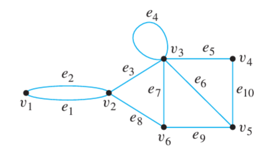
Are the following _walks_ also _trails, paths, circuits,_ or _simple circuits_?
```latex
v_1,e_1,v_2,e_3,v_3,e_4,v_3,e_5,v_4\\
e_1,e_3,e_5,e_5,e_6\\
v_2,v_3,v_4,v_5,v_3,v_6,v_2\\
v_2,v_3,v_4,v_5,v_6,v_2\\
v_1,e_1,v_2,e_1,v_1\\
v_1
```

## Connectivity in Graphs

#Definition An _undirected_ graph is **connected** if and only if there exists a _path_ between every possible pair of _vertices_

#DiscussionQuestion Which, if any, of the graphs depicted below are _connected_?

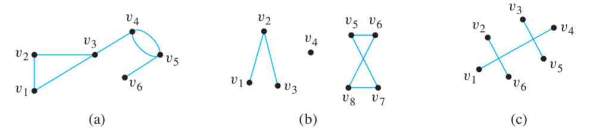

There are three definitions of _connected_ used for _digraphs_:

#Definition A _digraph_ is **weakly connected** if the underlying _undirected_ graph (the graph with edge-directions removed) is _connected_

_example:_


#Definition A _digraph_ is **unilaterally connected** if for every pair of vertices _x, y_, there is either a _path_ from _x_ to _y_ OR there is a _path_ from _y_ to _x_

_example:_
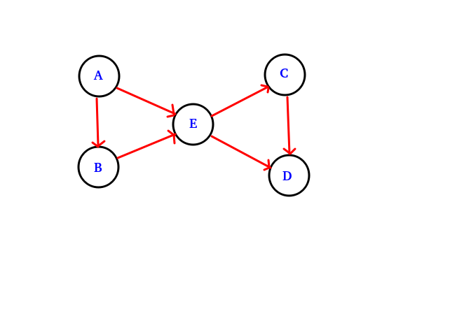
#Definition A digraph is **strongly connected** if for every pair of vertices _x, y_, there is a _path_ from _x_ to _y_ AND there is a _path_ from _y_ to _x_ 

_example:_


_#KnowledgeCheck: Is the following graph:_
* **weakly connected, but not unilaterally connected**
* **unilaterally connected, but not strongly connected**
* **strongly connected**
* **none of the above**


[[Graph Theory II]]