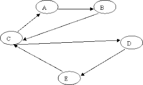

A Graph is a collection of **vertices** (or _nodes_), and **edges** between them. The previously introduced [[Trees]] are a special case of graphs with restrictions placed on the edges to enforce a _hierarchical_ relationship between nodes. Graphs generalize this concept by having no such restrictions, allowing us to represent any arbitrary relationship for the nodes. 

## Terminology

let G be the graph shown above
let V be the set of vertices in G
let E be the set of edges _<v, w>_ in G

For the above graph:
* V = {1, 2, 3, 4, 5, 6}
* E = {<1,2>, <2, 1>, <1,5>, <5,1>, <2,5>, <5,2>, <5,4>, <4,5>
       <2,3>, <3,2>, <3,4>, <4,3>, <4,6>, <6,4>}

Note that these two sets _uniquely identify_ a graph, the relative position of the nodes when drawn has no effect. Therefore, all the graphs shown below are in fact the same.

### Types of Graphs

In the above example G, E is _reflexive_ (if _<v,w>_ is in E then _<w,v>_ is in E). In this case, we call G an **undirected** graph. Otherwise, G is known as a **directed** graph (or _digraph)_, and is typically drawn with arrows to show the direction of edges.

We can also label edges in the same way we label vertices. In doing so, we create a **weighted** graph. Edges for weighted graphs become _3-tuples_ of _<source, destination, weight>_

* An edge _<v,v>_ is called a **loop**
* A graph without such loops is known as a **simple graph**

### Degree & Connectedness

We say that _w_ is **adjacent** to _v_ if _<v,w>_ is in E.

In a _digraph_:
* The **in-degree** of a vertex _v_ is the number of incoming edges to _v_
* The **out-degree** is the number of outgoing edges from _v_  

In an _undirected graph_
* The **degree** of a vertex _v_ is the number of vertices which are adjacent to _v_

The **degree** of a graph is the highest degree among all vertices.

A **path** is a sequence of vertices { v0, v1, ..., vn } such that <vi,vi+1> is in E for all i in {0, 1, ..., n-1}
  * _n_ (the number of edges) is the **length** of the path
  * A path can be empty
  * A path with no _loops_ is known as a **simple path**

A **cycle** is a path { v0, v1, ..., vn } where v0 == vn
  * **simple cycles** without loops are also distinguished

An _undirected_ graph is **connected** if there is a path from any vertex to any other vertex

There are three definitions of _connected_ used for digraphs:
  * A digraph is **weakly connected** if the underlying _undirected_ graph (the graph with edge-directions removed) is connected
  * A digraph is **unilaterally connected** if for every pair of vertices _x, y_, there is either a path from _x_ to _y_ OR there is a path from _y_ to _x_
  * A digraph is **strongly connected** if for every pair of vertices _x, y_, there is a path from _x_ to _y_ AND there is a path from _y_ to _x_ 

_KC: Is the following graph:_
* **weakly connected, but not unilaterally connected**
* **unilaterally connected, but not strongly connected**
* **strongly connected**
* **none of the above**

## Search/Traversals

Just like trees, graphs don’t have an inherent order to their nodes. We will often rely on graph-traversal algorithms to search and navigate graphs.

[[examples/graph-dfs]]

[DFS Visualization](https://www.cs.usfca.edu/~galles/visualization/DFS.html)

Does this algorithm seem familiar? It is closely related to the post-order traversal and even the recursive maze-solving algorithm.

[[graph-bfs]]

[BFS Visualization]()

BFS actually visits nodes in order of distance from the starting point, which gives it the interesting property of always finding the shortest path

---
## The Graph ADT

A Graph is a pair of sets _G = <V, E>_. V is the set of _vertices_ (or nodes), E is a set of pairs _<v, w>_ where _v, w_ are vertices in V representing the _edges_.

### Operations

* **adjacent(G, x, y)** -> true if _<x, y>_ in E
* **neighbors(G, x)** -> list all _y_ in V such that _<x, y>_ in E
  
* **add_vertex(G, x)** -> G’ with new vertex _x_
* **remove_vertex(G, x**) -> G’ without vertex _x_
* **add_edge(G, x, y)** -> G’ with new edge _<x, y>_
* **remove_edge(G, x, y)** -> G’ without edge _<x, y>_
  
* **get_vertex_value(G, x)** -> value associated with vertex _x_
* **set_vertex_value(G, x, v)** -> G’ with vertex _x_ set to v
* **get_edge_weight(G, x, y)** -> value associated with edge _<x, y>_
* **set_edge_weight(G, x, y, v)** -> G’ with edge _<x, y>_ set to weight v

---
## Applications for Graphs

Anything you can imagine! With a bit of creativity, you can see the world through the abstract lens of graphs. Graphs differ slightly from some of the other data structures we’ve seen, as they are most often used to support a problem-solving _algorithm_ rather than simply providing fast and efficient operations on arbitrary data.

Modeling:

Some classics:
* [Seven-Bridges of Königsberg](https://en.wikipedia.org/wiki/Seven_Bridges_of_K%C3%B6nigsberg)
* [Traveling Salesman Problem](https://en.wikipedia.org/wiki/Travelling_salesman_problem)
* [Four-Color Map Theorem](https://en.wikipedia.org/wiki/Four_color_theorem)

[[Graph Algorithms]]

---
## Graph Data Structures

### C++ standard library implementations:

The C++ standard library does not currently provide a standard graph implementation, but a graph can be built from other existing standard lib containers.

Part of the challenge of creating an efficient _general-purpose_ graph implementation is that the efficiency of operations can’t necessarily be inferred from the size of the data. The context of how the data is related is of critical importance when selecting a data structure for your graph.  

### Our Implementations:

[[AdjacencyMatrix]]

[[AdjacencyList]]

DQ: Which implementation would you choose for the following application?

Suppose you are writing a navigational software (think google maps) for the city of Rolla. You want to represent the _intersections_ between streets as vertices, and edges between adjacent intersections

What would the _degree_ of such a graph be?

If extended to cover the entire city, how many vertices?

Is this a _sparse_ graph, or a _dense_ graph?

