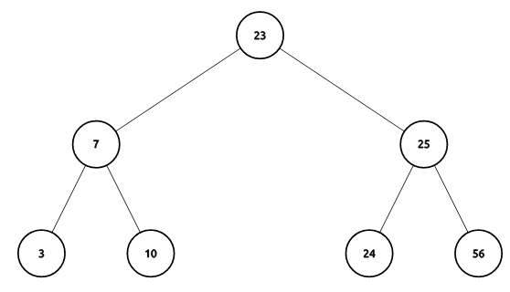
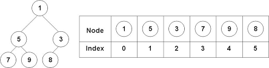

# Properties of Heaps

A heap is a **complete tree** that possesses the **heap property**. A complete tree is one in which every _level_ of the tree except the last level is completely full and the last level is partially filled from left to right.

Though a heap does not have to be a binary tree, binary heaps are widely studied.

The **min-heap property** means that given any node _N_ in the tree, _N_ is _lesser than_ all of its descendants. In a min-heap, the root node is the minimum element.

The **max-heap property** means that given any node _N_ in the tree, _N_ is _greater than_ all of its descendants. In a max-heap, the root node is the maximum element.

#KnowledgeCheck: Which of the following are valid heaps?



---


---


An interesting property of heaps is that they provide a **partial ordering** of the data. In informal terms, this simply means that not all elements are directly _comparable_ (nodes that are neither ancestor nor descendant are incomparable), but comparisons among elements is _transitive_ (if a > b && b > c then a > c). 

This matters because for use in a priority queue, we care only about the maximum/minimum element. A partial ordering like that of a heap is cheaper to maintain than a **total ordering** that would be given by a fully sorted collection.

# Building a Heap

You can view visualizations for these [here](http://btv.melezinek.cz/binary-heap.html)

## Adding nodes

DQ: 
* How to satisfy the _complete-tree_ property?
* How to satisfy the _heap_ property?

```
Enqueue-Heap(x):

  place x at ?

  while ( ? )
    swap ? with ?

```

## Removing nodes

DQ: 
* Which node would we want to remove (for a priority queue)?
* How to satisfy the _complete-tree_ property?
* How to satisfy the _heap_ property?

```
Dequeue-Heap(x):

  replace ? with ?

  while ( ? )
    swap ? with ?

```

## _Heapifying_ existing collection

DQ:
* How might we convert a random tree into a heap?
* Is this better than repeated insertions?

```
Sift-Down(x):

  while (?)
    swap ? with ?


Heapify collection by applying Sift-Down to each node, starting from the bottom
```


# Heaps and Data Structures

Even though logically a heap represents a tree structure, implementations of heaps most commonly make use of an array to store elements. This is an efficient choice because of the assumption that heaps are _complete_. 

To represent a heap using an array, we use a _level-ordering_ of the nodes. That is, we assign indices to nodes from top-to-bottom and left-to-right.



It is possible to make an array-based representation for any arbitrary tree, but it would require us to allocate empty space in the array for any missing nodes that would otherwise be present in a complete tree.

## Indexing Schemes

Given the i-th element of a binary heap (the element at index i),

Can you give a formula for the following?

  *  index of left-child : 
  *  index of right-child :
  *  index of parent : 

Challenge: Can you generalize these for heaps of degree 3 or degree n?

This gives us the ability to navigate our array-based heap in the same way that we would a tree-based heap implementation. Instead of following the edges of a tree, we simply apply the appropriate formula to our current array-index.

## C++ implementation for Binary Heap
  [[BinaryHeap]]

