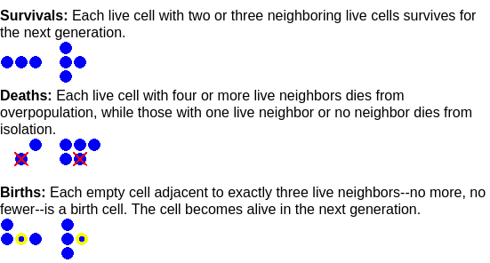

# Conway’s Game of Life

## Basic Rules


https://cs.stanford.edu/people/eroberts/courses/soco/projects/2001-02/cellular-automata/beginning/howtoplay.html

## Try it yourself!

https://playgameoflife.com/lexicon/1-2-3

## Now watch the masters


```embed
url: https://www.youtube.com/watch?v=Kk2MH9O4pXY
```

```embed
url: https://youtu.be/viA-HIW-2C4
```

## A “useless” computer? Maybe not!

https://en.wikipedia.org/wiki/Quantum_cellular_automaton

Computers of the future may take inspiration from cellular automata as a model of computation!

---

# What if the Rules were changed?

https://www.dcode.fr/game-of-life

# Let’s Build it Together!

https://leetcode.com/problems/game-of-life/

