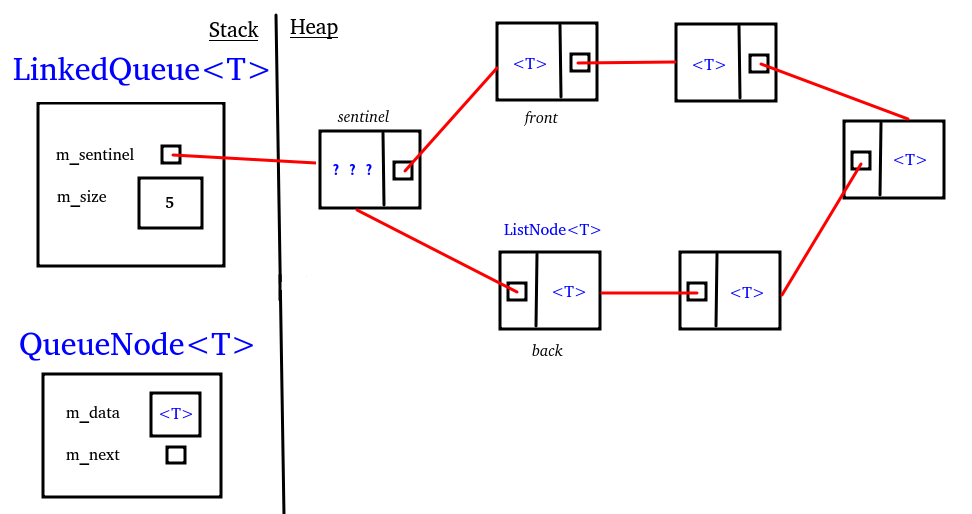

Consider the following queue:

   **< a0, a1, a2, ... , an >** 

Can [[LinkedList]] operations efficiently implement _front, enqueue, dequeue?_ 

How might we re-engineer the LinkedQueue to make all 3 operations into constant-time algorithms?

[[examples/linkedqueue-class]]

[[examples/linkedqueue-ops]]