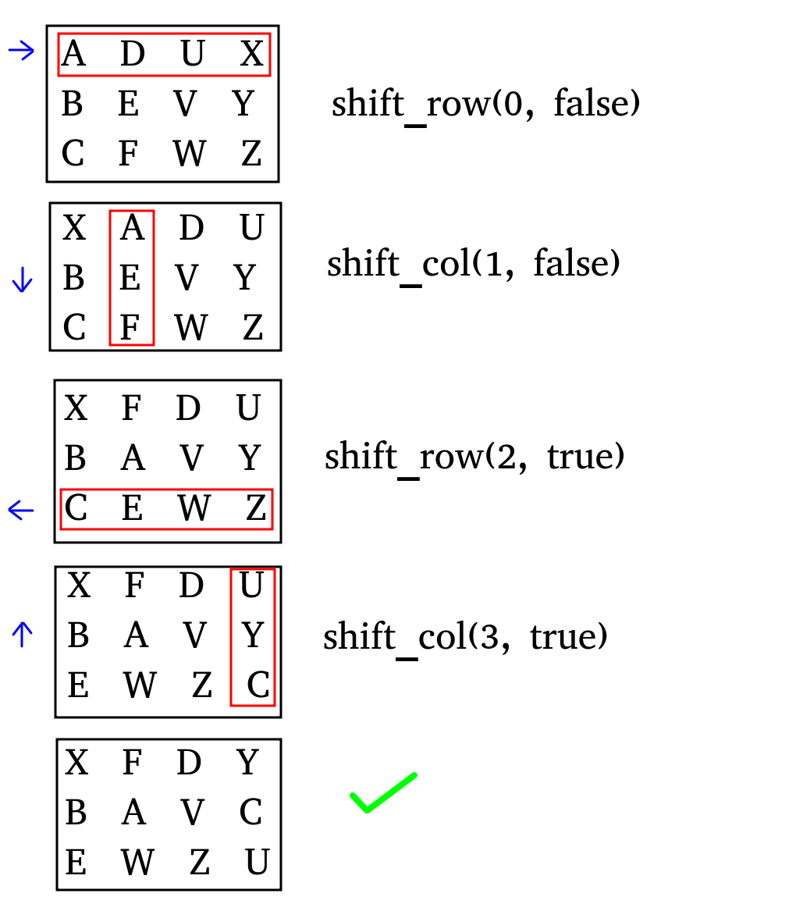

_Programming Assignment 1 (PA01)_

# Dynamically Allocated Two-Dimensional Arrays

--- 

## Assignment Description:
  

You are the world-renowned archeologist Jonathan Jones, out on yet another expedition filled with danger and mystery. You’ve finally arrived at the resting place of the ancient stone mask, but a series of puzzles blocks your path!

Each puzzle consists of a grid of symbols. Each row and each column of the puzzle can be rotated in either direction. When rotated, the furthest symbol wraps around to the opposite end of the grid, and the rest of the symbols each shift one position.



Since Jonathan Jones always comes prepared, you already know the solutions to these puzzles and have made a list of moves needed to get through each one.

## Input:

The input to your program is structured as follows:
```
< # of puzzles >
(for each puzzle:)
< # of rows > < # of columns > < # of moves >
[<char> <char> ... 
 <char> <char>
 ...              ] (symbols in puzzle)
(for each move:)
< row/column> < direction > (R - right, L - left, D - down, U - up)
```

### Sample input/output:

**INPUT:**
```
2
3 4 4
A D U X
B E V Y
C F W Z
0 R
1 D
2 L
3 U
2 2 1
@ #
$ %
1 R
```
**OUTPUT:**
```
X F D Y
B A V C
E W Z U

@ #
% $

```

For each puzzle you are to:
* Dynamically allocate a 2-D char array of the specified size
* Fill your puzzle with symbols from standard input
* Perform the necessary shifts to solve the puzzle, and output the result
* De-allocate your 2-D array to be used for the next puzzle

## Scoring:

To get full points on the assignment...
* Implement each function in the _Puzzle_ class **(unit_tests)**
* Complete the _main()_ function to solve all puzzles **(stdio_tests)**
* Fix any memory leaks or invalid memory operations **(mem_tests)**
* Address any warnings given by cppcheck **(static analysis)**
* Format your code using the clang-format utility **(style check)**

<!-- #include [[Grade dot sh]] -->
# General information regarding this repository

## Coding
Tips for coding.

### What to name my files?
We give you empty files corresponding to those you should complete!

### Where to code?
We assume you're on a Linux machine, and can install all the software needed by this auto-grader.
See the syllabus for more details.

### How to get this code?
Find the blue button that says "clone", on the home page of this repository.
If you have an ssh key set up:
 `git clone git@... `
If you don't have an ssh set up, or know what that is:
 `git clone https://.. `

### Where to read this file?
This file is nicely displayed in the Gitlab web interface, but you can read it wherever.

### What to install?
See the script's warnings.

### How to code?
Using this script, we strongly encourage you to program incrementally. 
Program code required by the unit tests, in the requested order. 
In general, don't proceed to a later function if you are not passing the first one.
If you get stuck, instead of moving on, get help!
See the syllabus for extended coding tips.

## Auto-grader

### How to run the auto-grader on your machine?
Run the following in the root directory of your repository:
 `./grade.sh `

## How to run the auto-grader on Gitlab-CI?
Make sure all your files are added, committed, and pushed to the appropriate branch (see Git section below).
Navigate to the Gitlab web interface to confirm these changes exist on the server.

## How to make sure I'm getting points?
 * Click on CI/CD -> Jobs -> the latest job.
 * Is it passing, green, etc? 
 * What grade does it say you have?
 * Whatever grade the latest job says, is what we think you have!

## std-io tests: differences between your std-out and the desired std-out
See:  `your _diffs/ ` and  `your _outputs ` to determine what went wrong. 
We run these diffs automatically, so you may not need to manually inspect these files.

## Unit tests: we're micromanaging your functions!
See the unit tests themselves, and run them in your favorite debugger:
 `unit _tests/ `

## Git
Git happens...

### add, commit, push
From within your git repository (folder), add, commit, and push all the non-generated files. 
This means add your cpp and png files, but not a.out, etc.
Verify you can see the files on git-classes in the web interface.
If you can see the correct files on git-classes in your master branch, your submission is complete.
Make sure all the requested files are in the root directory of the repository unless otherwise specified.

## Errors
You should not change any of the grading files themselves. 
If you do, you will see a warning, and it will give you a 0.
If you accidentally did that:
`git checkout firstfourcharactersoflastcommitbyus graderfileyoubroke`

### Is the auto-grader broken?
Is the error you're encountering our fault or yours?
Either may be possible, while the latter is a bit more likely.
Double-check all the diffs, and step through all code to see.
If you think you found a bug, please let us know!

## When is this due?
See the syllabus!

## grade.sh: this automated grading framework
For more details on the generalized auto-grader, see:
https://gitlab.com/classroomcode/grade-sh/grade-sh
<!-- /include -->
