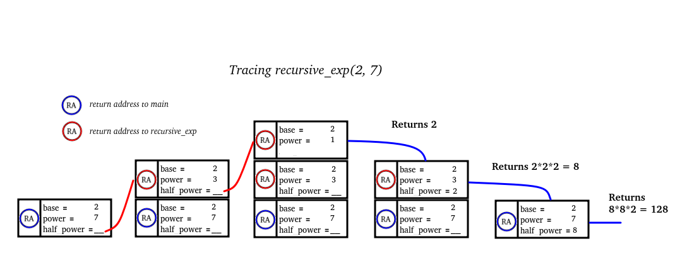

# What is Recursion

Click here for an explanation: [[Recursion]]


Just kidding. Recursion is a means of mathematical definition in which one or more components or properties of an object are defined in terms of the object itself.

For example, suppose you’ve been tasked with formally defining the set of natural numbers to a room of very uptight mathematicians. 
You might give the answer:
  _1, 2, 3, 4, ..._
But this isn’t good enough for the mathematicians, you just gave some examples not a formal description!

You might try again with something like:
  _A natural number is a positive number without decimals_
While this is true of all natural numbers, the crowd still won’t be satisfied unless you define the words _positive_ and _decimal_! 🤓

You finally decide to use a **recursive definition**:
  * 1 is a natural number
  * _n_ is a natural number if and only if _n-1_ is a natural number
And the mathematicians nod in approval

_Recursion_ is a means of defining something in terms of itself.

Every recursive definition will have two components:
* One or more **Base Cases** - statements that give a direct answer/result
* One or more **Recursive Cases** - statements that give an indirect answer in terms of the object in question

---
# Recursion as a Problem-Solving Tool

So why do we care? Well as computer scientists, our particular flavor of “problem-solving” revolves around simply giving a very careful and precise definition of the problem at hand. It may be unsurprising, therefore, that recursion is not only deeply ingrained into the theory of computer science, it is also a powerful tool to apply towards high-level problems.

In a recursive algorithm, we take the _global_ problem to be solved and formulate it in terms of smaller _sub-problems_ that are easier to solve but still have the same structure as the global. It relates to the classic problem-solving strategy of _Divide-and-Conquer_. 

A _recursive algorithm_ consists of the following components:
* **Base Case** - an instance of the problem that can be solved directly
* **Recursive Case** - a _Decomposition_ of the problem into smaller instances, along with a complete solution _Composed_ from the smaller solutions

Here, _smaller_ means that it must make some amount of progress toward a directly solvable _Base Case_

Let’s write a recursive algorithm for computing exponents
- What is our _Base Case(s)?_
- What is our _Recursive Case(s)?_
  
[[examples/recursion-exponentiation]]


---
# Tracing Recursion

It can be sometimes be difficult to envision where your code will go in a recursive algorithm, but we can easily keep track by remembering the call-stack.

This example uses the [[examples/recursion-exponentiation]] algorithm
```c++
int main()
{
  int n;
  n = recursive_exp(2, 7);
  std::cout<< n << std::endl;

  return 0;
}
```


Here is another example using a recursive _factorial_ algorithm:

```c++
int factorial(int n)
{
  if (n == 1 || n == 0) // Base Cases
    return 1;
  int solution = n * factorial(n-1); // Recursive Case
  return solution;
}
```


We can also think of execution with some helpful rules-of-thumb:

* Code _before_ a recursive call will resolve before anything else
* Code _after_ a recursive call will resolve only **after all recursive calls** have returned. This means that the return statement of the _initial_ call is actually be the _last_ to be executed.

#KnowledgeCheck Trace the execution of recursive_pow(2,65), how many total multiplications occur across all recursive calls? (do not try to calculate the value, just count the number of * operations)

---
# Classifying Recursion

Recursion can come in several forms:

* Linear - Single recursive call made per non-base case

* Multiple - Two or more (branching) recursive calls made 

* Indirect - FuncA() calls FuncB(), calls FuncA(), calls FuncB() ...


---
# A Blueprint for Recursive Algorithms

In general, all recursive algorithms follow the same basic structure:

```
recursive_function(X):

  if X is a base case:
    return solution_X

  else:
    Decompose(X) -> {x1, x2, ..., xn}
    solution_1 <- recursive_function(x1)
    solution_2 <- recursive_function(x2)
    ...
    solution_n <- recursive_function(xn)

    solution_X <- Compose(solution_1, solution_2, ..., solution_n)
    return solution_X
```

Of course, _n_ is often just 1 or 2 and the process of _Decompose()_ and _Compose()_ can take on many forms.

### The Tower of Hanoi

This is a very famous game involving moving stacks of increasingly sized rings around 3 or more pegs [Try it youself](http://towersofhanoi.info/Play.aspx)

It is a topic that has long inspired mathematicians and computer scientists alike as a very elegant example of the _magic_ of recursion.
Let’s tackle the challenge of writing an algorithm to produce a list of moves to solve the Tower of Hanoi

[[Tower of Hanoi]]

---
# Recursion and Data Structures

Some data structures are purposefully designed with recursion in mind, or just so happen to store data using a recursive structure.

There is a particularly deep body of data structures that use [[Trees]] to represent data, which are inherently recursive objects and thus lend themselves well to operations implemented by recursive algorithms.

We have already seen an example of a recursive data structure; however, when we noted that the _ListNode_ class alone is sufficient to implement the _List_ abstract data type. To think of these operations recursively, simply note that _m_next_ in this implementation points to either:
  * nullptr (**Base Case**)
  * a smaller (size n-1) list (**Recursive Case**)


As an exercise, how might you write a recursive version of the _Find_ or _Size_ operations for this particular list implementation?

[[examples/recursion-linkedlist-find]]

[[examples/recursion-linkedlist-size]]

---
# The Efficiency of Recursion

We’ve seen how recursion is a powerful tool for helping us think about problems differently and create elegant solutions, but how does it relate to the efficiency of our programs?

## When Recursion goes wrong

A classic example of recursion is that of the _Fibonacci Sequence_

  _1, 1, 2, 3, 5, 8, 13, 21, 34, 55, 89, 144, ..._

Where the i-th Fibonacci number is the sum of the two previous, with the exception that the first and second numbers are _1, 1_

This is so often to introduce recursion to programmers because it’s so simple. The i-th Fibonacci number is so clearly recursively defined that the algorithm practically writes itself!

```c++
int fib(int i) // return the i-th Fibonacci number
{
  if (i == 1 || i == 2) // Base Cases
    return 1;

  return fib(i-1) + fib(i-2); // Recursive Case
}
```

However, those programmers (hopefully) then come to learn that this algorithm is horribly inefficient and are taught a much better iterative algorithm to use instead.

So what gives? Why is something so quintessentially recursive in nature such a bad candidate for a recursive algorithm?
* **Are all recursive algorithms _horribly inefficient_?** (no)
* **Should we always try to use iteration instead?** (not necessarily)
* **Is recursion _scary_?** (not if you understand where fib() goes wrong)

What you need to avoid in a recursive algorithm is _redundant sub-problems_. Taking a _top-down_ approach (starting at fib(i) and working towards the base case of fib(1) or fib(2)) causes you to re-compute a lot of information that you already know.

fib(6) makes a call to fib(5), then a call to fib(4). However, the 4th Fibonacci number was already calculated in the call to fib(5)! 


This wasteful re-calculation very quickly gets out of hand, and it’s why a _bottom-up_ approach like the iterative algorithm is the correct choice.

Note that there is a technique in the field of _Dynamic Programming_ for tackling this problem of redundant sub-problems known as _memoization_, but it is beyond the scope of this course.

## The hidden cost of a function

Even if a recursive and iterative version of an algorithm have the same _analytical_ time-complexity, you may often find that the iterative version outperforms _empirically._ This is because of another consideration for recursive algorithms which is the cost of maintaining the _call stack_.

Remember that every time we make a function call, a _stack frame_ is generated with information about the current state of the program before the new function takes control. This takes a non-trivial amount of time to do, but we disregard it during analytical testing as it is technically environment-dependent and does not have an effect on rate-of-growth.

What this tells us is that while recursive algorithms are good enough for most purposes and can offer significantly increased readability/maintainability, if speed is your primary concern you may look for an iterative equivalent.

## Recursion is looping, looping is Recursion

It may not come as a surprise that iteration and recursion are often two sides of the same coin. After all, loops in C++ can be thought of as shorthand for recursive functions.

```c++
for( init ; test ; update )
{
  body
}

void loop(i)
{
  if (test(i) == false)
    return

  body(i)
  loop(update(i))
}
```

```c++
while (test)
{
  body
}

void loop()
{
  if (test == false)
    return

  body
  loop()
}
```

This is not actually how looping works in C++, but you can see how they are logically equivalent for solving problems. That is why simple recursive algorithms are often interchangeable with their iterative counterparts.

However, for more some recursive algorithms there is not always an obvious iterative equivalent. In these instances, if we want a non-recursive algorithm that behaves the same we need to _simulate_ recursion by replacing the _call stack_ with a stack of our own.

```c++
int fake_recursive_factorial(int n)
{
  vector<int> stack;
  int result = 1;
  while(n > 1)  // simulating recursive calls
  {
    stack.push_back(n);
    n--;
  }
  while(!stack.empty()) // simulating those functions returning
  {
    result *= stack.back();
    stack.pop_back();
  }

  return result;
}
```

This is a sometimes helpful optimization to make when the amount of information passed between recursive calls is relatively small and is often employed for tree/graph _traversals_.

---
# Recursive Backtracking

Another interesting use for recursion is for solving multi-step problems via systematically _guessing_ the right answer for each step and _backtracking_ to a previous step when it becomes clear that a mistake has been made. While this approach is not always the most efficient approach, it is still a clever improvement over blindly _brute-forcing_ a solution as it can allow us to avoid testing combinations of steps that we know won’t lead to the solution.

It relates to the classic problem-solving technique _Trial-and-Error_ and can be applied to puzzles, mazes, decision-making games, and more! A classic example of a game where recursive backtracking is applied is the _n-Queens_ problem.

The **N-Queens problem** is as follows:
  _Given a n-by-n chessboard, place n queen pieces such that no two queens can attack each other_

Pseudocode for the _n-Queens_ problem:
```
1. try-queen(int row):
2.   int col <- first valid column
3.   while valid columns remaining
4.     place i-th queen at `col`
5.     if no more queens
6.       return success
7.     trial <- try-queen(i+1)
8.     if trial is success
9.       return success
10.     else
11.       retract i-th queen placement
12.      col <- next valid column
13.   return failure
```

Try to follow the algorithm yourself [here](http://eightqueen.becher-sundstroem.de/). Visualize each row as it’s own recursive function call and picture the call stack as you go.

**General recursive backtracking blueprint**

```c++
bool solve()
{

  if finished // check base case
    return true // success!
  
  possible_moves = {move1, move2, ..., moveN}

  for move in possible_moves // exhaust all valid options
  {
    if valid(move)
    {
      select(move)
      found_solution = solve() // continue to next step
      if found_solution
        return true // future moves were successful!
      else
        undo(move) // current move led to dead end ☠️
     }
   } 

  // If here, no moves were valid/successful
  return false; // dead end
    
}
```
