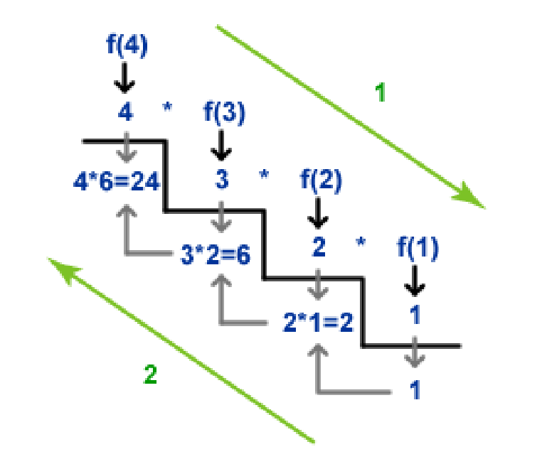

# What is Recursion

Click here for an explanation: [[Recursion]]


Just kidding. Recursion is a means of mathematical definition in which one or more components or properties of an object are defined in terms of the object itself.

For example, suppose you’ve been tasked with formally defining the set of natural numbers to a room of very uptight mathematicians. 
You might give the answer:
  _1, 2, 3, 4, ..._
But this isn’t good enough for the mathematicians, you just gave some examples not a formal description!

You might try again with something like:
  _A natural number is a positive number without decimals_
While this is true of all natural numbers, the crowd still won’t be satisfied unless you define the words _positive_ and _decimal_! 🤓

You finally decide to use a **recursive definition**:
  * 1 is a natural number
  * _n_ is a natural number if and only if _n-1_ is a natural number
And the mathematicians nod in approval

Every recursive definition will have two components:
* One or more **Base Cases** - statements that give a direct answer/result
* One or more **Recursive Cases** - statements that give an indirect answer in terms of the object in question

---
# Recursion as a Problem-Solving Tool

So why do we care? Well as computer scientists, our particular flavor of “problem-solving” revolves around simply giving a very careful and precise definition of the problem at hand. It may be unsurprising, therefore, that recursion is not only deeply ingrained into the theory of computer science, it is also a powerful tool to apply towards high-level problems.


In a recursive algorithm, we take the _global_ problem to be solved and formulate it in terms of smaller _sub-problems_ that are easier to solve but still have the same structure as the global. It relates to the classic problem-solving strategy of _Divide-and-Conquer_. 

For this we give very similar definitions to mathematical recursion:
* **Base Case** - an instance of the problem that can be solved directly
* **Recursive Case** - a _Decomposition_ of the problem into smaller instances, along with a complete solution _Composed_ from the smaller solutions

Here, _smaller_ means that it must make some amount of progress toward a directly solvable _Base Case_, otherwise our algorithm would never end!

Let’s write a recursive algorithm for computing exponents
- What is our _Base Case(s)?_
- What is our _Recursive Case(s)?_
  
[[examples/recursion-exponentiation]]

What is the time complexity of our algorithm?

---
# Tracing Recursion

It can be sometimes be difficult to envision where your code will go in a recursive algorithm, but we can easily keep track by remembering our good friend the call stack!

```c++
int factorial(int n)
{
  if (n == 1 || n == 0) // Base Cases
    return 1;
  int solution = n * factorial(n-1); // Recursive Case
  return solution;
}
```


```CS = []```

We can also think of execution with some helpful rules-of-thumb:

* Code _before_ a recursive call will resolve before anything else
* Code _after_ a recursive call will resolve only **after all recursive calls** have returned. This means lines of code in the _initial_ call can actually be the _last_ to be executed.

---
# Classifying Recursion

Recursion can come in several forms:

* Linear - Single recursive call made per non-base case

* Multiple - Two or more (branching) recursive calls made 

* Indirect - FuncA() calls FuncB(), calls FuncA(), calls FuncB() ...


---
# A Blueprint for Recursive Algorithms

In general, all recursive algorithms follow the same basic structure:

```
recursive_function(X):

  if X is a base case:
    return solution_X

  else:
    Decompose(X) -> {x1, x2, ..., xn}
    solution_1 <- recursive_function(x1)
    solution_2 <- recursive_function(x2)
    ...
    solution_n <- recursive_function(xn)

    solution_X <- Compose(solution_1, solution_2, ..., solution_n)
    return solution_X
```

Of course, _n_ is often just 1 or 2 and the process of _Decompose()_ and _Compose()_ can take on many forms.

### The Tower of Hanoi

This is a very famous game involving moving stacks of increasingly sized rings around 3 or more pegs [Try it youself](http://towersofhanoi.info/Play.aspx)

It is a topic that has long inspired mathematicians and computer scientists alike as a very elegant example of the _magic_ of recursion.
Let’s tackle the challenge of writing an algorithm to produce a list of moves to solve the Tower of Hanoi

[[Tower of Hanoi]]

---
# Recursion and Data Structures

Some data structures are purposefully designed with recursion in mind, or just so happen to store data using a recursive structure.

There is a particularly deep body of data structures that use [[Trees]] to represent data, which are inherently recursive objects and thus lend themselves well to operations implemented by recursive algorithms.

We have already seen an example of a recursive data structure; however, when we noted that the _ListNode_ class alone is sufficient to implement the _List_ abstract data type. To think of these operations recursively, simply note that _m_next_ in this implementation points to either:
  * nullptr (**Base Case**)
  * a smaller (size n-1) list (**Recursive Case**)

<>

---
# The Efficiency of Recursion

