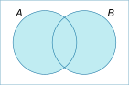
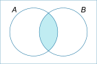
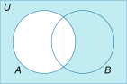

# Set Theory

#Definition A **set** is an _unordered_ collection of _unique_ elements

The **empty set**, denoted ∅ or {}, is the set containing no elements

**Set-builder notation** allows you to conveniently define a set of elements that share a common _property_.

Suppose **S** is a set and **P(x)** is a predicate accepting element **x**, then
```latex
A = \{x \in S | P(x) \}
```
**A** is the set of all **x** in **S** such that **P(x)** is _true_


#Definition If **A** and **B** are sets, **A is a subset of B** if and only if every element of **A** is also an element of **B**
```latex
A \subseteq B \leftrightarrow \forall x, x \in A \rightarrow x \in B
```
```latex
A \nsubseteq B \leftrightarrow \exists x \text{ such that } x \in A \land x \notin B
```

#Definition If **A** and **B** are sets, **A is a proper subset of B** if and only if **A** is a subset of **B** and there is at least one element of **B** that is not an element of **A**
```latex
A \subset B \leftrightarrow A \subseteq B \land (\exists x \in B \text{ such that } x \notin A)
```

#Definition If **A** is a set, then the **power set** of **A** is the set of all _subsets of A_. This always includes the _empty set_

_example:_
```latex
\mathbb{P}(\{x,y\}) = \{\{\}, \{x\}, \{y\}, \{x,y\}\}
```

## Proving the Subset Property

Statements such as _A is a subset of B_ can often be proven directly

1. Suppose generic element of A
2. Using only definitions, theorems, and rules of logical inference, demonstrate that element must belong to B
3. Conclude that A is a subset of B

_example:_
```latex
A = \{m\in \Z \mid \exists r \in \Z \text{ s.t. } m = 6r+12 \}\\
B = \{n \in \Z \mid \exists s \in \Z \text{ s.t. }n=3s \}
```

Suppose **a** is any element of **A**. 
Then **a = 6r + 12 = 3(2r + 4)** for some integer **r**.
Now let **s = 2r + 4**, which is an integer by closure.
It follows that **a = 3s** and **a** must be an element of **B**.

Therefore, **A** is a subset of **B**.

In general, it is also possible to use any of the indirect proof techniques or even induction to prove these statements

#DiscussionQuestion Using A and B defined above, is B a subset of A?

#Theorem If A and B are sets, then A _is equal to_ B if and only if A is a subset of B and B is a subset of A
```latex
A = B \leftrightarrow A \subseteq B \land B \subseteq A
```

#DiscussionQuestion For A and B defined below, is A = B?
```latex
A = \{ m \in \Z \mid \exists a \in \Z \text{ s.t. }m=2a \}\\
B = \{ n \in \Z \mid \exists b \in \Z \text{ s.t. }n=2b-2 \}
```

## Set Operations

Let **S** be the _universal set_ (scope/context) for the definitions below

#Definition If A and B are sets, the **union** of A and B is the set containing all elements that belong to A or belong to B.
```latex
A \cup B = \{x \in S \mid x \in A \lor x \in B \}
```



#Definition If A and B are sets, the **intersection** of A and B is the set containing all elements that belong to both A and B.
```latex
A \cap B = \{x\in S \mid x \in A \land x \in B \}
```



#Definition If A and B are sets, the **difference** of A and B is the set of all elements that belong to A but do not belong to B.
```latex
A - B = \{x\in S \mid x\in A \land x\notin B\}
```


#Definition If A is a set, the **complement** of A is the set of all elements which do not belong to A.
```latex
A^c = \{x\in S \mid x\notin A\}
```



## Subsets as Intervals

**Intervals** can also be expressed as subsets of the (real) number-line.

```latex
(a,b] = \{x \in \R \mid a < x \leq b\}
```

In the example above, “**(a**“ means that the interval begins at _but does not include_ **a**. This means that values of **x** within the interval are _strictly greater than (<)_ **a**

“**b]**“ means that the interval ends at _and includes_ **b**. This means that values of **x** within the interval are _less than or equal to (<=)_ **b** 

#KnowledgeCheck Let A and B be defined as
```latex
A = (-1,0] = \{x\in \R \mid -1 < x \leq 0 \}\\
B = [0,1) = \{x\in\R\mid 0\leq x < 1 \}
```
Express the following in terms of _x_
```latex
A \cup B\\
A \cap B\\
B - A\\
A^c
```

## Multi-set Union & Multi-set Intersection notation

#Definition If **A** is an _indexed collection of sets_, then the symbol
```latex
\bigcup_{i=0}^nA_i
```
represents the set containing all elements belonging to _at least one_ set in **A_0, A_1, ... , A_n**


#Definition If **A** is an _indexed collection of sets_, then the symbol
```latex
\bigcap_{i=0}^nA_i
```
represents the set containing all elements that belong to _every_ set in **A_0, A_1, ... , A_n**

_example:_

Let **A** be a collection of sets defined below:
```latex
A_i = \{x \in \R \mid -\frac{1}{i} < x < \frac{1}{i}\}
```

Then,
```latex
\bigcup_{i=1}^3A_i = A_1 \cup A_2 \cup A_3\\
= \{-1 < x < 1\} \cup \{-\frac{1}{2} < x < \frac{1}{2}\} \cup \{-\frac{1}{3} < x < \frac{1}{3}\}\\
= \{ x \in \R \mid -1 < x < 1 \}
```
and
```latex
\bigcap_{i=1}^3A_i = A_1 \cap A_2 \cap A_3\\
= \{-1 < x < 1\} \cap \{-\frac{1}{2} < x < \frac{1}{2}\} \cap \{-\frac{1}{3} < x < \frac{1}{3}\}\\
= A_3
```

#DiscussionQuestion Suppose that there are an infinite number of indexed sets in **A**, defined as above. What would be the value of
```latex
\bigcup_{i=1}^\infty A_i\\
\text{and}\\
\bigcap_{i=1}^\infty A_i
```

## Partitions

#Definition If **A** and **B** are sets, then we say that **A** and **B** are **disjoint** or **mutually exclusive** if and only if they share no common elements.
```latex
\text{A and B are mutually exclusive} \Leftrightarrow A \cap B = \emptyset
```

#Definition If **A, B**, and **C** are sets, then we say that **A** and **B** **exhaust** or **cover** **C** if and only if **C** is equal to the _union_ of **A** and **B**.
```latex
\text{A and B exhaust C} \Leftrightarrow A \cup B = C
```

#Definition If **A** is a set and **P** is an _indexed collection of sets_, then **P** is a **partition** of **A** if and only if:
* The elements of **P** are _non-empty_ sets
* The elements of **P** are _mutually exclusive_
* The elements of **P** _exhaust_ **A**
```latex
\text{P is a partition of A} \Leftrightarrow \\

\emptyset \notin P\\
\bigcap_{i=0}^nP_i = \emptyset\\
\bigcup_{i=0}^nP_i = A
```
where **n** is the number of sets in **P**

_example:_

Let **T** be an indexed collection of sets defined below:
```latex
T_0 = \{n \in \Z \mid \exists k \in \Z, n=3k\}\\
T_1 = \{n \in \Z \mid \exists k \in \Z, n=3k+1\}\\
T_2 = \{n \in \Z \mid \exists k \in \Z, n=3k+2\}\\
```

Is **T** a _partition_ of the set of all integers?
_hint: Quotient-remainder theorem_

#KnowledgeCheck True or False: 
**{{a,d,e},{b,c},{d,f}}** is a _partition_ of **{a,b,c,d,e,f}**

## Ordered Pairs & Cartesian Products

#Definition For elements **a** and **b**, the set **{{a},{a,b}}**, also denoted **(a,b)**, is the **ordered pair** where **a** is the _first element_ and **b** is the _second element_

Two _ordered pairs_, **(a,b)** and **(c,d)**, are _equal_ if and only if **a = c** and **b = d**

This concept of an ordered pair becomes very important as sets in general have no way of expressing an order to the elements within.

#Definition Given sets **A** and **B**, the **Cartesian product** of **A** and **B**, denoted **A x B**, is the set of all _ordered pairs_ **(a,b)** where **a** is in **A** and **b** is in **B**.
```latex
A \times B = \{(a,b) \mid a \in A \land b \in B\}
```

This definition can be generalized for the **Cartesian product** of _n_ sets, which will produce a set of _ordered n-tuples_.
```latex
A \times B \times C = \{(a,b,c) \mid a \in A \land b \in B \land c \in C\}
```

#BoardQuestion Let **A = {x,y}**, **B = {1,2,3}**, and **C = {a,b}**
Calculate the following _Cartesian products_:
* **A x C**
* **A x B x C**
* **(A x B) x C**
