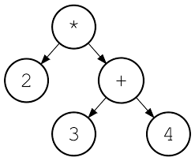

Trees are a very special mathematical object that have inspired many data structures and algorithms. Trees appear all throughout the field of computer science in the most unexpected of places.

# 🌲 and Me: an introduction

Trees consist of **nodes** and **edges**. Nodes represent individual elements and edges form connections between them. For those familiar with graph theory, a Tree is a special case of [[Graphs]] (specifically a _connected, undirected, acyclic graph_).

## Terminology

* The **root** stands at the top of the hierarchy
* Any nodes directly connected to the root are its **children**
* All nodes (except the root) have exactly one **parent**
  * A **cycle** cannot exist in a tree
  * A tree with _n_ nodes has exactly _n-1_ edges
* A node with no children is called a **leaf**

* The **degree** of a node is the number of children that it has
* The **degree** of a tree is the highest degree of any node

A **path** in a tree is a sequence of nodes <n0, n1, ... , nk> such that for all {i = 0, 1, ... , k-1}, n(i+1) is the parent of n(i)
  * k is the **length** of such a path
  * Every node has a unique path from itself to the root

For any given node _N_
* All nodes along its unique path to the root are **ancestors** of _N_
* All nodes for which there is a path to _N_ are its **descendants**

* The **depth** of a node is the length of the unique path to the root
  * The root has a depth of zero
* Nodes with the same depth form a **level** of the tree
* The **height** of a tree is the number of levels it has

There are many ways of defining the properties of Trees, but for this class we are most interested in their _recursive_ structure.

  * a single node is a tree
  * two trees joined by a single edge is also a tree

What does this tell us? _Any_ node in a tree forms a **sub-tree** with its descendants... recursion ensues!

# Applications for Trees

**Expression trees**

**File systems**

**Data structures & Algorithms!**

_honorable mentions:_ parse trees(Theory), spanning trees(Networks), decision trees(AI)

# Trees and Data Structures

Instead of a _linear ordering_ of the data like that of the _sequence-based_ abstract data types we’ve seen before (stack, queue, list), tree-based ADT make use of a _hierarchical_ relationship. 

It is common to define a general-purpose _Tree_ Abstract Data Type for interacting with data that has an inherent hierarchical structure (see: Applications for Trees). For this course, however, we will focus on _Tree-inspired_ ADT and Data Structures that can be applied to any collection of data but utilize a hierarchy for efficiency purposes

## Working with unordered data

Because there is no linear ordering to a tree, we need to devise algorithms for _enumerating_ the data whenever we want to traverse through it. There are a number of ways to do this and each one gives us a different _order_. 

[[examples/pre-order-traversal]]

[[examples/post-order-traversal]]

You can experiment with these algorithms for binary trees [here](https://tree-visualizer.netlify.app/)

## Special Trees

A tree for optimizing _search/find_ operations
[[BST]]

A tree for optimizing _getMax/getMin_ operations
[[Heaps]]