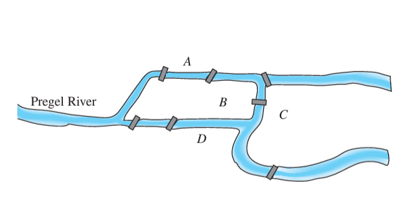

#cs1200LN
|  |  |  |  |
|----------|----------|----------|----------|
| [[CS1200|Home]] | [[CS1200 Calendar|Calendar]] | [[CS1200 Syllabus]] | [[Lecture Notes]] |


## Reminders

```query
cs1200task
where done = false
order by pos
limit 4
render [[template/topic]]
```

## Objectives

```query
task
where page = "CS1200 Calendar" and done = false
limit 3
order by pos
render [[template/topic]]
```
---

## Euler Circuits & Trails

#Definition An **Euler circuit** is a _circuit_ that includes every _vertex_ at least once and includes every _edge_ exactly once

_example:_ **The Seven Bridges of Konigsberg**


Behold the very first _Graph_. Legendary mathematician _Leonhard Euler_ was walking the streets of Konigsberg, Prussia one day and considered the following question:

  _Is it possible to walk around the city, crossing each bridge exactly once, and end up in the same place you started_?

To answer this question, Euler decided to represent the city as a set of points for each of the land-masses and a set of edges for each of the seven bridges. This was a concept that did not yet exist in mathematics!


Euler’s paper analyzing the problem went on to spark the entire field of _Graph Theory_, and the seminal problem he considered came to be known as an _Euler Circuit_

#DiscussionQuestion If you were Euler, what would your conclusion be? Does an _Euler circuit_ exist for the graph of Konigsberg?


#Theorem If a graph **G** has an _Euler circuit_, then every element of **V(G)** must have an even, positive _degree_.

#DiscussionQuestion What does the above theorem say about graphs with a vertex of odd degree?

#Definition An **Euler trail** from **v** to **w** (where **v** and **w** must be _distinct_) is a _trail_ that includes every _vertex_ at least once and includes every _edge_ exactly once.

#Theorem An **Euler trail** from **v** to **w** exists if **G** is _connected_, **v** and **w** are of odd _degree_, and every other vertex (**V(G) - {v,w}**) is of positive, even _degree_

_example:_

Consider the floor-plan below:


Is it possible to visit every room of the house using every door exactly once?

To consider this as a graph problem, convert to a _graph representation_ where the rooms are _vertices_ and doors are _edges_


The question then becomes: **Does the graph above have an Euler trail?**

---
## Hamiltonian Circuits

#Definition A **Hamiltonian circuit** is a _simple circuit_ that includes every vertex of the graph exactly once.


#Theorem If a graph **G** has a _Hamiltonian circuit_, then there exists a _subgraph_ **H** of **G** with the following properties:
* **H** contains every vertex of **G**
* **H** is connected
* **H** has the same number of _edges_ and _vertices_ (**|V(H)| = |E(H)|**)
* Every _vertex_ of **H** has degree 2

_by Contraposition:_
If no such **H** can be constructed, then **G** has no _Hamiltonian circuit_

#DiscussionQuestion Using the theorem above, prove that the graph shown below DOES NOT have a Hamiltonian circuit


_example:_ **The Traveling Salesman**

A classic problem in computer science, the _traveling salesman_ problem asks:

  _For a collection of houses with known distances between them, what is the quickest way for a door-to-door salesman to visit every house on his/her route (starting and stopping at the salesman’s own house)_

To answer this, one can consider a _weighted-graph representation_ of the problem, and aim to find the _Hamiltonian circuit_ with the least total weight


| Possible HC | Total Distance (weight) |
|----------|----------|
| ABCDA | 30 + 30 + 25 + 40 = 125 |
| ABDCA | 30 + 35 + 25 + 50 = 140 |
| ACBDA | 50 + 30 + 35 + 40 = 155 |
| ACDBA | 50 + 25 + 35 + 30 = 140 |
| ADBCA | 40 + 35 + 30 + 50 = 155 |
| ADCBA | 40 + 25 + 30 + 30 = 125 |

Note that this brute-force method of finding every _Hamiltonian circuit_ and calculating the minimum is **VERY SLOW**. 

Finding an efficient algorithm to solve this problem is an open problem in computer science and generally considered impossible. Though many efficient methods of getting an _approximate_ solution have been proposed

---
# Trees

#Definition A graph is **acyclic** if and only if it contains no _circuits_

#Definition A **tree** is a _connected, acyclic graph_

#Definition A **forest** is an _acyclic_ graph that is not _connected_

Note that this also means that _trees_ cannot have parallel edges or loops, as those always result in a _circuit_. Therefore, all _trees_ are _simple graphs_

#Theorem A graph **G** of **n** vertices is a _tree_ if and only if **G** is _connected_ and has exactly _n-1_ edges


## Spanning Trees

#Definition A **spanning tree** of an undirected graph **G** is a _sub-graph_ of **G** that is both a _tree_ and includes every element of **V(G)**

#Definition A **minimum spanning tree** of a weighted graph is the _spanning tree_ with the lowest total weight
