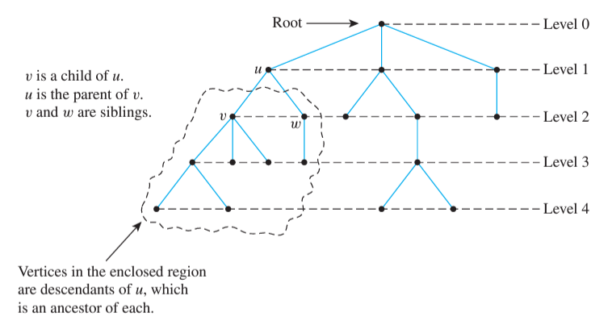
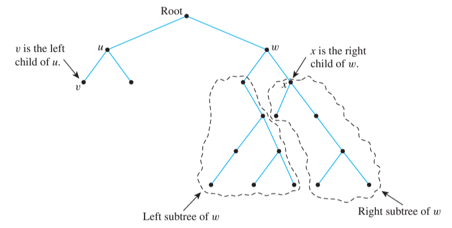

#cs1200LN
|  |  |  |  |
|----------|----------|----------|----------|
| [[CS1200|Home]] | [[CS1200 Calendar|Calendar]] | [[CS1200 Syllabus]] | [[Lecture Notes]] |


## Reminders

```query
cs1200task
where done = false
order by pos
limit 4
render [[template/topic]]
```

## Objectives

```query
task
where page = "CS1200 Calendar" and done = false
limit 3
order by pos
render [[template/topic]]
```
---

# Trees

#Definition A graph is **circuit-free** (or **acyclic**) if and only if it contains no _circuits_

#Definition A **tree** is a _connected, acyclic graph_

#Definition A **forest** is an _acyclic_ graph that is not _connected_


Note that _trees_ cannot have parallel edges or loops, as those always result in a _circuit_. Therefore, all _trees_ are _simple graphs_

#Theorem A simple graph **G** of **n** vertices is a _tree_ if and only if **G** is _connected_ and has exactly **n-1** edges

#ChallengeQuestion Can you give an argument for the theorem above using _Mathematical Induction_?

## Rooted Trees

#Definition A **rooted tree** designates one vertex as the **root**, and characterizes the rest of the vertices relative to the _root_.



### Binary Trees

#Definition In a **binary tree**, vertices have a parent and a maximum of two children. These children are typically distinguished as the _left-child_ or _right-child_



## Applications of Trees

Trees are widely applied to many problems both in and out of computer science. Below are just a few such examples

_Decision Trees_


_Characterizing Hydrocarbon Isomers_


## Spanning Trees

#Definition A **spanning tree** of an undirected graph **G** is a _sub-graph_ of **G** that is both a _tree_ and includes every element of **V(G)**

_example:_ **Railway planning**

Suppose that a shipping company plans to build a series of railroads connecting several major cities. The surveyors have determined the routes that would be possible to build, depicted by edges in the graph below


To cut costs, the company wants to ensure that every city is reachable in their rail system using the fewest possible connections.

_Circuits_ are therefore, an unnecessary luxury. The company seeks a _spanning tree_ of the surveyors’ graph 


But wait! Shorter rails are cheaper to build than longer ones. To truly minimize costs, the company should find a way to connect all cities using the least total distance 

#Definition A **minimum spanning tree** of a weighted graph is the _spanning tree_ with the lowest total weight


There are several methods of forming a _minimum spanning tree_ efficiently. Two such algorithms are described below:

### Kruskal’s Algorithm

_Kruskal’s Algorithm_ takes a given _connected_ graph **G** and generates a _subgraph_ **H** that is guaranteed to be a _minimum spanning tree_

1. Set **V(H) = V(G)**, **E(H) = { }** to begin
2. Let **n** represent **|V(H)|** and let **m** represent **|E(H)|** (initially, 0)
3. Create set **S = E(G)**
  4. Let **e** be an edge from **S** with the minimal weight
  5. If adding **e** to **E(H)** would _not_ create a circuit, do so
  6. Remove **e** from **S**
7. Repeat steps 4-7 if **m** < **n-1**

### Prim’s Algorithm

_Prim’s Algorithm_ takes a different approach, beginning at an arbitrarily chosen starting node and growing the MST outward from that point

1. Set **V(H)** to any starting vertex **a** in **G** initially
2. Create set **S = V(G) - a**
  3. Locate edge **e** such that
     * **e** has one endpoint in **V(H)** and one endpoint (**b**) in **S**
     * **e** has the minimal weight of all such edges
  4. Add **e** and **b** to **H**
  5. Remove **b** from **S**
6. If **S** is non-empty, repeat steps 3-6 