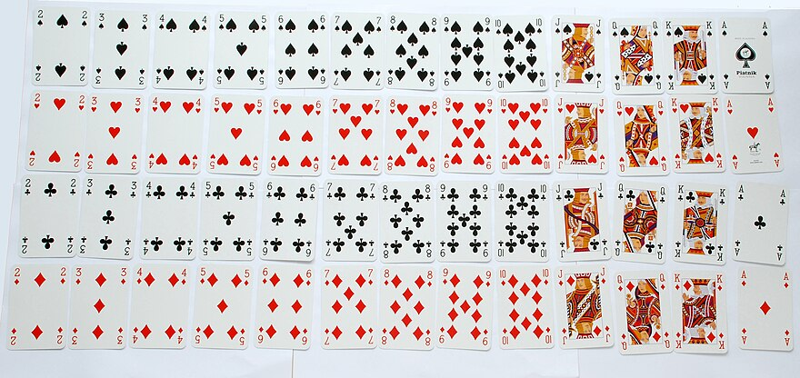

#cs1200LN
|  |  |  |  |
|----------|----------|----------|----------|
| [[CS1200|Home]] | [[CS1200 Calendar|Calendar]] | [[CS1200 Syllabus]] | [[Lecture Notes]] |


## Reminders

```query
cs1200task
where done = false
order by pos
limit 4
render [[template/topic]]
```

## Objectives

```query
task
where page = "CS1200 Calendar" and done = false
limit 3
order by pos
render [[template/topic]]
```
---

* Inductive Proofs (more practice)
* Practice problems pool
* Collection of important definitions*
* Double check lecture notes
* Practice session (inductive proofs + sets/relations/functions)


In this section we will discuss _events_, the _likelihood_ of particular _outcomes_, and the art of ... _counting_  

# Probability

#DiscussionQuestion Suppose you tossed two coins, checked their face values, and repeated this experiment a total of 8 times. How many times would both coins land heads (at the same time)?

#Definition A **random experiment** (or **random process**) is one in which you know what the outcome could (potentially) be, but it is impossible to know for sure until it actually happens


#Definition The **sample space** of a _random process_ is the set of all possible outcomes that you could observe

For instance, if considering flipping two coins, the _sample space_ would be: 
**{(Heads, Heads), (Heads, Tails), (Tails, Heads), (Tails, Tails)}**

In some cases, like the coin toss, each outcome in the _sample space_
is equally likely to happen. Such experiments are called _uniform random_, but this is not always the case.


#Definition An **event** is a subset of a _sample space_


_Some example events for our coin-toss experiment:_
* _Both coins land heads_ is represented by **{(Heads,Heads)}**
* _Both coins land the same_ is represented by **{(Heads,Heads),(Tails,Tails)}**
* _At least one coin lands heads_ is represented by **{(Heads,Heads),(Heads,Tails),(Tails,Heads)}**

(_equally-likely probability_)
#Definition Given a uniform random _event_ **E** with sample space **S**, the **probability of E**, denoted **P(E)**, is the number of outcomes in **E** (**|E|**) divided by the number of outcomes in **S** (**|S|**)
```latex
\text{Probability of event }E \Leftrightarrow P(E) = \frac{|E|}{|S|}
```

#Theorem The probability of any _event_ will always be a real number between 0 and 1

#DiscussionQuestion What are the probabilities of the following events?
* Both coins land heads - 1/4
* Both coins land the same - 2/4 
* At least one coin lands heads - 3/4


A standard deck of playing cards consists of:


Consider the experiment of drawing a card from a full deck. Suppose this is a _uniform random experiment_ with sample space **S**.

Define the following events:
* **E1** : _A club is drawn_
* **E2** : _An ace is drawn_
* **E3** : _The Ace of Clubs is drawn_

To analyze the probability of these events, we need to calculate **|S|, |E1|, |E2|,** and **|E3|** (the number of elements in each set, respectively)

* **|S|** = 52
* **|E1|** = 13
* **|E2|** = 4
* **|E3|** = 1

Therefore,
```latex
P(E_1) = \frac{|E_1|}{|S|} = \frac{13}{52} = 0.25\\
P(E_2) = \frac{|E_2|}{|S|} = \frac{4}{52} \approx 0.077\\
P(E_3) = \frac{|E_3|}{|S|} = \frac{1}{52} \approx 0.019
```


_The Monty Hall Problem_

You have been chosen as a contestant on a game-show. In front of you are three closed doors, one of which hides a brand new car! If you pick the right door, then the car is yours to keep. 

After you select your door, the host of the show (who knows what is behind each door) opens one of the remaining doors to reveal that it is empty. The host then offers you a choice, stick with your original door or switch to the other still-closed door.

#DiscussionQuestion What would be your decision in this scenario? Does it matter if the contestant switches or not?
