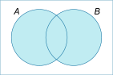
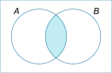
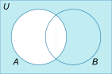

---
tags:
  - cs1200LN
date: {}
---
#cs1200LN
|  |  |  |  |
|----------|----------|----------|----------|
| [[CS1200|Home]] | [[CS1200 Calendar|Calendar]] | [[CS1200 Syllabus]] | [[Lecture Notes]] |


## Reminders

```query
cs1200task
where done = false
order by pos
limit 4
render [[template/topic]]
```

## Objectives

```query
task
where page = "CS1200 Calendar" and done = false
limit 3
order by pos
render [[template/topic]]
```
---

* [ ] Induction Proofs  📅2024-06-28 #cs1200task


# Set Theory

#Definition A **set** is an _unordered_ collection of _unique_ elements

The **empty set**, denoted ∅ or {}, is the set containing no elements

**Set-builder notation** allows you to conveniently define a set of elements that share a common _property_.

Suppose **S** is a set and **P(x)** is a predicate accepting element **x**, then
```latex
A = \{x \in S | P(x) \}
```
**A** is the set of all **x** in **S** such that **P(x)** is _true_


#Definition If **A** and **B** are sets, **A is a subset of B** if and only if every element of **A** is also an element of **B**
```latex
A \subseteq B \leftrightarrow \forall x, x \in A \rightarrow x \in B
```
```latex
A \nsubseteq B \leftrightarrow \exists x \text{ such that } x \in A \land x \notin B
```

#Definition If **A** and **B** are sets, **A is a proper subset of B** if and only if **A** is a subset of **B** and there is at least one element of **B** that is not an element of **A**
```latex
A \subset B \leftrightarrow A \subseteq B \land (\exists x \in B \text{ such that } x \notin A)
```

#Definition If **A** is a set, then the **power set** of **A** is the set of all _subsets of A_. This always includes the _empty set_

_example:_
```latex
\mathbb{P}(\{x,y\}) = \{\{\}, \{x\}, \{y\}, \{x,y\}\}
```

## Proving the Subset Property

Statements such as _A is a subset of B_ can often be proven directly

1. Suppose generic element of A
2. Using only definitions, theorems, and rules of logical inference, demonstrate that element must belong to B
3. Conclude that A is a subset of B

_example:_
```latex
A = \{m\in \Z \mid \exists r \in \Z \text{ s.t. } m = 6r+12 \}\\
B = \{n \in \Z \mid \exists s \in \Z \text{ s.t. }n=3s \}
```

Suppose **a** is any element of **A**. 
Then **a = 6r + 12 = 3(2r + 4)** for some integer **r**.
Now let **s = 2r + 4**, which is an integer by closure.
It follows that **a = 3s** and **a** must be an element of **B**.

Therefore, **A** is a subset of **B**.

In general, it is also possible to use any of the indirect proof techniques or even induction to prove these statements

#DiscussionQuestion Using A and B defined above, is B a subset of A?

#Theorem If A and B are sets, then A _is equal to_ B if and only if A is a subset of B and B is a subset of A
```latex
A = B \leftrightarrow A \subseteq B \land B \subseteq A
```

#DiscussionQuestion For A and B defined below, is A = B?
```latex
A = \{ m \in \Z \mid \exists a \in \Z \text{ s.t. }m=2a \}\\
B = \{ n \in \Z \mid \exists b \in \Z \text{ s.t. }n=2b-2 \}
```

* [ ] Joseph S  📅2024-06-26 #cs1200EC

To prove that B is a subset of A, 2b-2 can be rewritten as 2 * (b-1).  b-1 is an integer because integers are closed under subtraction, meaning that all elements of B are of the form 2*integer, just like every element in A

* [ ] Brileigh  📅2024-06-26 #cs1200EC

Proof: Suppose t is an arbitrary element in A.
Then t=2a for some integer a
substitution yields:
t=2a=2a+2-2=2(a+1)-2
let m=a+1 where m is an integer by closure of Z under addition and multiplication.
thus, t=2m-2, where m is an integer.
therefore, A is a subset of B.

* [ ] Drake  📅2024-06-26 #cs1200EC

m=2a, ==m=2b−2==, 2a=2b−2, 2a+2=2b, a+1=b. Set 
𝑏=𝑎+1. Since a is in all integers, b is in all integers. Hence m = 2(a+1)-2=2b-2, which implies m in B

* [ ] kody  📅2024-06-26 #cs1200EC

## Set Operations

Let **S** be the _universal set_ (scope/context) for the definitions below

#Definition If A and B are sets, the **union** of A and B is the set containing all elements that belong to A or belong to B.
```latex
A \cup B = \{x \in S \mid x \in A \lor x \in B \}
```



#Definition If A and B are sets, the **intersection** of A and B is the set containing all elements that belong to both A and B.
```latex
A \cap B = \{x\in S \mid x \in A \land x \in B \}
```



* [ ] kody  📅2024-06-26 #cs1200EC

#Definition If A and B are sets, the **difference** of A and B is the set of all elements that belong to A but do not belong to B.
```latex
A - B = \{x\in S \mid x\in A \land x\notin B\}
```


#Definition If A is a set, the **complement** of A is the set of all elements which do not belong to A.
```latex
A^c = \{x\in S \mid x\notin A\}
```



## Subsets as Intervals

**Intervals** can also be expressed as subsets of the (real) number-line.

```latex
(a,b] = \{x \in \R \mid a < x \leq b\}
```

In the example above, “**(a**“ means that the interval begins at _but does not include_ **a**. This means that values of **x** within the interval are _strictly greater than (<)_ **a**

“**b]**“ means that the interval ends at _and includes_ **b**. This means that values of **x** within the interval are _less than or equal to (<=)_ **b** 

#KnowledgeCheck Let A and B be defined as
```latex
A = (-1,0] = \{x\in \R \mid -1 < x \leq 0 \}\\
B = [0,1) = \{x\in\R\mid 0\leq x < 1 \}
```
Express the following in terms of _x_
```latex
A \cup B\\
A \cap B\\
B - A\\
A^c
```

* [ ] brileigh  📅2024-06-26 #cs1200EC
 (-1, 1) = {x in R | -1 < x < 1}

* [ ] Drake  📅2024-06-26 #cs1200EC
[0,0] = {0}

* [ ] Joseph S.  📅2024-06-26 #cs1200EC
(0,1) = {x in R | 0 < x < 1}

* [ ] Austin  📅2024-06-26 #cs1200task
(-inf, -1] U (0, inf) = {x in R | x <= -1 or x > 0}


## Multi-set Union & Multi-set Intersection notation

#Definition If **A** is an _indexed collection of sets_, then the symbol
```latex
\bigcup_{i=0}^nA_i
```
represents the set containing all elements belonging to _at least one_ set in **A_0, A_1, ... , A_n**


#Definition If **A** is an _indexed collection of sets_, then the symbol
```latex
\bigcap_{i=0}^nA_i
```
represents the set containing all elements that belong to _every_ set in **A_0, A_1, ... , A_n**

