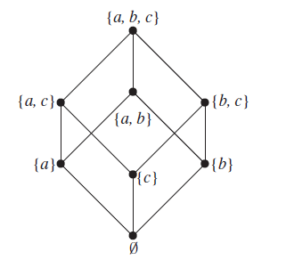

---
tags:
  - cs1200LN
  - DiscussionQuestion
date: {}
---
#cs1200LN
|  |  |  |  |
|----------|----------|----------|----------|
| [[CS1200|Home]] | [[CS1200 Calendar|Calendar]] | [[CS1200 Syllabus]] | [[Lecture Notes]] |


## Reminders

```query
cs1200task
where done = false
order by pos
limit 4
render [[template/topic]]
```

## Objectives

```query
task
where page = "CS1200 Calendar" and done = false
limit 3
order by pos
render [[template/topic]]
```
---

* [x] Exam 2  📅2024-07-10 #cs1200task

# Partial Order Relations

#Definition A relation **R** on a set **A** is a **partial order relation** if and only if **R** is _reflexive, anti-symmetric, and transitive_

_example:_
Recall the relation
```latex
x R y \Leftrightarrow x \leq y
```
on the set of real numbers

```latex
xRx \Leftrightarrow x \leq x \text{ is true }\forall x \in \R\\
\therefore R \text{ is reflexive}
```

```latex
xRy \land yRx \Leftrightarrow (x \leq y) \land (y \leq x)\text{ is true only if }x = y\\
\therefore R \text{ is anti-symmetric} 
```

```latex
\forall x,y,z \in R, (x \leq y) \land (y \leq z) \rightarrow (x \leq z) \text{ by well-known principles of algebra}\\
\Leftrightarrow xRy \land yRz \rightarrow xRz\\
\therefore R \text{ is transitive}  
```

Therefore, **R** is a _partial order_ relation

Because _partial orders_ are often used to formalize the concept of **precedence** between elements of a set, a special symbol is used for these types of relations
```latex
a \prec b \Leftrightarrow \text{a relates to b [in a partial order relation]}\\
\Leftrightarrow \text{a precedes b}\\
and\\
a \preccurlyeq b \Leftrightarrow \text{a relates to or is equal to b}

```
Often, the symbols above are read as “a is less than or equal to b.” This should not be confused, however, with the specific relation expressed by 
```latex
aRb \Leftrightarrow a \leq b
```

_example:_ **Precedence relationships**

Consider the computer science courses offered at S&T:
* **CS1200** - Discrete Mathematics
* **CS1500** - Computational Problem Solving
* **CS1570** - Intro to C++ Programming
* **CS1575** - Data Structures
* **CS2300** - Databases
* **CS2500** - Algorithms
* ...

Students are free to take whatever courses they wish, but the system of prerequisites imposes a _partial order_ for when to take what

```latex
x\preccurlyeq y \Leftrightarrow xRy\\
\Leftrightarrow \text{ course x is a prerequisite for or is equal to course y }
```

#DiscussionQuestion
* Is **R** reflexive?
* Is **R** anti-symmetric?
* Is **R** transitive?

_example:_ **Lexicographic order**

Let **S** be a set of character strings and let **R** be a relation on **S** that is defined as follows:

For any two strings
```latex
s_1 = a_1a_2...a_m\\
s_2 = b_1b_2...b_n\\
m,n \in \Z^+
```

1. If **m <= n** and **a_i = b_i** for all **i = 1,2,...,m** then
```latex
a_1a_2...a_m \preccurlyeq b_1b_2...b_m...b_n
  
```
2. If for some integer **k** with **k <= m, k <= n,** and **k >= 1**,
**a_i = b_i** for all **i = 1,2,...,k-1** and **a_k != b_k** but **a_k R b_k** then
```latex
a_1a_2...a_{k-1}a_k...a_m \preccurlyeq b_1b_2...b_n  
```
3. If **e** is the empty string and **s** is any string in **S** then
```latex
e \preccurlyeq s
  
```

The relation above, combined with a _partial order relation_ for individual characters, is an example of a _partial order relation_ for lexicographic strings 

#DiscussionQuestion Based on the relation defined above, are the following strings related?
```latex
x \preccurlyeq xx ?\\
xxxy \preccurlyeq xxy ?\\
e \preccurlyeq xy ?
```

* [ ] john  📅2024-07-08 #cs1200EC
* [ ] brileigh  📅2024-07-08 #cs1200EC
* [ ] joseph  📅2024-07-08 #cs1200EC

# Hasse Diagrams

Think back to illustrating relations with _directed graphs_. Complex relations on large sets with many elements can become difficult to visualize as graphs. 

#Definition A **Hasse diagram** is a simplified representation of a _partial order relation_ that can be obtained as follows:
1. **Begin with the directed graph representation. Draw the points of this graph so that all arrows point upwards**
2. **Eliminate all “self-loops” representing x R x**
3. **Eliminate all arrows whose existence is implied by transitivity**
4. **Convert all arrows to solid lines**

_example:_
Let **A = {1,2,3,9,18}** and let **R** be the _Divides_ relation
#BoardQuestion Draw the directed graph of **R** and convert to a _Hasse diagram_

* [ ] joseph  📅2024-07-08 #cs1200EC

#BoardQuestion The _Hasse diagram_ representation for the _Subset_ relation (a R b means “a is a subset of b”) is depicted below.


Convert this back into a _directed graph_

# Comparability & Compatibility

#Definition Given a _partial order relation_ **R** on set **A**, elements **a,b** are **comparable** if and only if **a R b** or **b R a**
```latex
aRb \Leftrightarrow a \preccurlyeq b
\Leftrightarrow \text{a is comparable to b}\\
\text{a is not comparable to b} \Leftrightarrow a \npreceq b \land b \npreceq a
```

#Definition If **R** is a _partial order relation_ such that **a R b** or **b R a** for all elements **a,b** then **R** is called a **total order relation**

#Definition For a given _partial order relation_,

Element **a** is the **Greatest element** if and only if
```latex
\forall b \in A, b \preccurlyeq a
```

Element **a** is the **Least element** if and only if
```latex
\forall b \in A, a \preccurlyeq b
```

Element **a** is the **Maximal element** if and only if
```latex
\forall b \in A, b \preccurlyeq a\text{ or }a\text{ is not comparable to }b
```

Element **a** is the **Minimal element** if and only if
```latex
\forall b \in A, a \preccurlyeq b\text{ or }a\text{ is not comparable to }b
```

#DiscussionQuestion Consider the Hasse diagram of the _Subset_ relation.
* Which elements (if any) are the _greatest element(s)_?
* Which elements (if any) are the _least element(s)_?
* Which elements (if any) are the _maximal element(s)_?
* Which elements (if any) are the _minimal element(s)_?

* [ ] joseph S. 📅2024-07-08 #cs1200EC
* [ ] brileigh  📅2024-07-08 #cs1200EC
* [ ]   📅2024-07-08 #cs1200EC

#Definition A **chain** is a subset of a _partial order relation_ in which all the elements are _comparable_

#Definition Given two _partial order relations_, **R** and **S** on a set **A**, we say that **S** is **compatible** with **R** if and only if
```latex
\forall a,b \in A, aRb \rightarrow aSb
```

#Definition A _total order relation_ **S** is a **Topological Sorting** of a _partial order_ **R** if **S** is compatible with **R**


