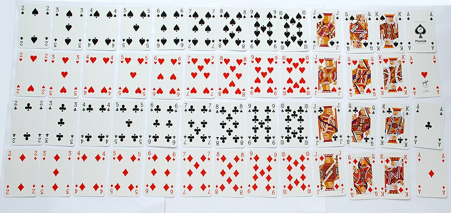

---
tags:
  - cs1200LN
date: {}
---
#cs1200LN
|  |  |  |  |
|----------|----------|----------|----------|
| [[CS1200|Home]] | [[CS1200 Calendar|Calendar]] | [[CS1200 Syllabus]] | [[Lecture Notes]] |


## Reminders

```query
cs1200task
where done = false
order by pos
limit 4
render [[template/topic]]
```

## Objectives

```query
task
where page = "CS1200 Calendar" and done = false
limit 3
order by pos
render [[template/topic]]
```
---

In this section we will discuss _randomness_, the _likelihood_ of particular _events_, and the art of ... _counting_  

# Probability

#DiscussionQuestion Suppose you tossed two coins, checked their face values, and repeated this experiment a total of 8 times. How many times would both coins land heads (at the same time)?

#Definition A **random experiment** (or **random process**) is one in which you know what the outcome could (potentially) be, but it is impossible to know for sure until it actually happens


#Definition The **sample space** of a _random process_ is the set of all possible outcomes that you could observe

For instance, if considering flipping two coins, the _sample space_ would be: 
**{(Heads, Heads), (Heads, Tails), (Tails, Heads), (Tails, Tails)}**

In some cases, like the coin toss, each outcome in the _sample space_
is equally likely to happen. Such experiments are called _uniform random_, but this is not always the case.


#Definition An **event** is a subset of a _sample space_


_Some example events for our coin-toss experiment:_
* _Both coins land heads_ is represented by **{(Heads,Heads)}**
* _Both coins land the same_ is represented by **{(Heads,Heads),(Tails,Tails)}**
* _At least one coin lands heads_ is represented by **{(Heads,Heads),(Heads,Tails),(Tails,Heads)}**

(_equally-likely probability_)
#Definition Given a uniform random _event_ **E** with sample space **S**, the **probability of E**, denoted **P(E)**, is the number of outcomes in **E** (**|E|**) divided by the number of outcomes in **S** (**|S|**)
```latex
\text{Probability of event }E \Leftrightarrow P(E) = \frac{|E|}{|S|}
```

#Theorem The probability of any _event_ will always be a real number between 0 and 1

#DiscussionQuestion What are the probabilities of the following events?
* Both coins land heads - 1/4 = 0.25
* Both coins land the same - 2/4 = 0.5
* At least one coin lands heads - 3/4 = 0.75

* [ ] john  📅2024-07-11 #cs1200EC
* [ ] brileigh  📅2024-07-11 #cs1200EC

A standard deck of playing cards consists of:


Consider the experiment of drawing a card from a full deck. Suppose this is a _uniform random experiment_ with sample space **S**.

Define the following events:
* **E1** : _A club is drawn_
* **E2** : _An ace is drawn_
* **E3** : _The Ace of Clubs is drawn_

To analyze the probability of these events, we need to calculate **|S|, |E1|, |E2|,** and **|E3|** (the number of elements in each set, respectively)

* **|S|** = 52
* **|E1|** = 13
* **|E2|** = 4
* **|E3|** = 1

Therefore,
```latex
P(E_1) = \frac{|E_1|}{|S|} = \frac{13}{52} = 0.25\\
P(E_2) = \frac{|E_2|}{|S|} = \frac{4}{52} \approx 0.077\\
P(E_3) = \frac{|E_3|}{|S|} = \frac{1}{52} \approx 0.019
```


_The Monty Hall Problem_

You have been chosen as a contestant on a game-show. In front of you are three closed doors, one of which hides a brand new car! If you pick the right door, then the car is yours to keep. 

After you select your door, the host of the show (who knows what is behind each door) opens one of the remaining doors to reveal that it is empty. The host then offers you a choice, stick with your original door or switch to the other still-closed door.

#DiscussionQuestion What would be your decision in this scenario? Does it matter if the contestant switches or not?

* [ ] kody, austin, drake  📅2024-07-11 #cs1200EC

# Counting Sets

From the exercises above, we can see that computing probabilities often relies on knowing the number of elements in various sets representing _sample spaces_ and _events_.

In some cases, counting the number of elements in a set is trivial. Other times, when the set is very large, the task is not so easy. The field of _combinatorics_ applies mathematical principles to count and arrange sets that would otherwise be infeasible to compute by hand


#DiscussionQuestion Consider the C++ code below

```c++
int count-elements(int n, int m)
{
// Count integers between n and m (inclusive)

  int total = 0; 

  for(int i = n; i <= m; i++)
    total = total + 1;
}
```

Can we calculate the result of **count-elements(n,m)** without looping?

n - 2
m - 17

17 - (2-1) = 16

**m - (n-1)**


## Helpful Counting Theorems

When looking at repeated random experiments or random processes with multiple steps, computing probabilities will often require counting the number of possible combinations of outcomes or decisions

#Definition Two events are **independent** if and only if the outcome of one event has no effect on the outcome of the other

#Theorem (_The Multiplication Rule_): Consider a process which consists of _k_ _independent_ steps.
```latex
\text{Let }n_1\text{ represent the number of ways to perform step }1\\
\text{Let }n_2\text{ represent the number of ways to perform step }2\\
...\\
\text{Let }n_k\text{ represent the number of ways to perform step }k\\
\text{Then the number of ways to perform the whole process is }n_1n_2...n_k
```

---
_example:_ **Guessing Passwords**

Suppose you want to know the probability of randomly guessing an 8-digit password which can contain the characters {0-9,a-z,A-Z} and has no other restrictions

If we suppose that every password is equally likely, and that whatever guess we make is also uniform random, then it suffices to know what is the total number of possible 8-digit passwords

Model the process of creating a password as an operation involving 8 independent steps, one for selecting each character

**Number of ways to select the first character:**

  There are 10 numerical digits, 26 lowercase letters, and 26 uppercase letters which gives us a total of **62** options

Because there are no further restrictions, we can reason that there are the same number of options for the remaining 7 characters.

Therefore, _by the multiplication rule_, the number of ways to generate a unique password is 
  **62(62)(62)(62)(62)(62)(62)(62) = 218,340,105,584,896**

Consider this as the size of our _sample space_. The size of the _event_ “the generated password matches the first guess exactly” is 1

The probability of guessing a randomly generated password is then:
```latex
P(\text{correct guess}) = \frac{1}{218340105584896} \approx 0.00000000000000458
```

#DiscussionQuestion How might this probabilistic model of password-guessing differ from a real-world scenario? Is there anything an attacker could exploit to improve their odds of guessing correctly? Is there anything a user can do to decrease the odds of their password being guessed?

---
_example:_ **Anagrams**

Let us suppose a different scenario where a theoretical attacker has physical access to your computer (which is password-protected) and makes a keen observation that some keys on your keyboard are significantly more worn than others.


The attacker makes the assumption that your password likely consists of these characters. Furthermore, because no one key is more worn than the rest, they reason that there are no repeated characters. Each of the 8 slightly-faded characters appears exactly once.

In this scenario, how likely is the attacker to guess your password? In other words, how many passwords could you create using exactly those 8 characters?

To model this problem, let us again consider selecting a character of the password as one step in a multi-stage process.

**Ways to select the first character:** ?
**Ways to select the second character:** ?
**...**
**Ways to select the eighth character:** ?

_Using the multiplication rule_
**Total number of possible passwords:** ?

---

## Permutations

#Definition A **permutation** of a finite set is a _total ordering_ of the elements

#Theorem The number of permutations of a set with **n** elements is **n(n-1)...(2)(1) = n!**

#Definition An **r-permutation** of a set with **n** elements is an ordered selection of **r** elements taken from the set (without replacement). The number of _r-permutations_ of a set of **n** elements is denoted **P(n,r)**

#Theorem If **n** and **r** are integers such that **1 <= r <= n**, then the total number of _r-permutations_ of a set of **n** elements is given by the formula:
```latex
P(n,r) = n(n-1)(n-2)...(n-r+1) = \frac{n!}{(n-r)!}
```

---
_example:_ **non-repeating passwords**

Consider adding the restriction that passwords cannot contain duplicate characters. With only this restriction, how many 8-character passwords can we create?

We could model this from scratch, or we could observe that generating a valid password this way is the same as selecting 8 valid but unique characters and putting them in a specific order.

The total number of non-repeating passwords is therefore the same as the number of _8-permutations_ of a set with _62_ elements or **P(62,8)**
```latex
P(62,8) = \frac{62!}{(62-8)!} = \frac{62!}{54!}
```

**62!** and **54!** are too big to calculate directly (conveniently), but we can cancel some terms to simplify
```latex
\frac{62!}{54!} = \frac{62(61)...(54)(53)...(2)(1)}{54(53)...(2)(1)}
= \frac{62(61)...\cancel{(54)(53)...(2)(1)}}{\cancel{54(53)...(2)(1)}}
= \frac{62(61)(60)(59)(58)(57)(56)(55)}{1}
```
This gives us a total of **136,325,893,334,400** possible non-repeating passwords

---

#Theorem (_The Addition Rule_): Suppose finite set **A** is the union of **k** mutually disjoint subsets
```latex
A = A_1 \cup A_2 \cup ... \cup A_k
```
Then the number of elements in **A** is the sum of the number of elements in each subset
```latex
|A| = |A_1| + |A_2| + ... + |A_k|
```

---
_example:_ **variable-length passwords**

Suppose that we allow a password to range from 4-8 characters. How does this change the total number of possible passwords?

We can apply the _addition rule_ to figure this out. Consider the following sets:
* **P** - The set of all passwords
* **A** - The set of all 8-character passwords
* **B** - The set of all 7-character passwords
* **C** - The set of all 6-character passwords
* **D** - The set of all 5-character passwords
* **E** - The set of all 4-character passwords 

Clearly,
```latex
P = A \cup B \cup C \cup D \cup E
```
Thus, to figure out **|P|** we first need to calculate

* **|A|** = 218,340,105,584,896
* **|B|** = ?
* **|C|** = ?
* **|D|** = ?
* **|E|** = ?

Therefore, the total number of possible passwords is 
**|P|** = ?

---

#Theorem (_The Difference Rule_): Suppose set **B** is a subset of a finite set **A**, then
```latex
|A-B| = |A| - |B|
```

---
_example:_ **non-dictionary passwords**

A common tactic for attackers is to not guess a password randomly, but instead focus on guessing passwords that spell out English words. The reasoning is that these passwords are much easier to remember for the users and thus more likely to be chosen

Suppose that we add a restriction to our 8-character passwords that they cannot be words found in the dictionary. For reference, the official Scrabble® Dictionary contains **80148** 8-letter words. In this case, how many valid passwords can we generate?

**A** - The set of all 8-character passwords
**B** - The set of all 8-letter English words

Suppose that **B** is a subset of **A** (ignore the possibility of words with non-alphanumeric characters)

**|A|** = 218,340,105,584,896
**|B|** = 80148

Therefore, by the _difference rule_, the total number of valid passwords is **|A| - |B|** = 218,340,105,504,748

---
## Probability of Complements

#Theorem If **S** is a finite _sample space_ and **E** is an event in **S**, then
```latex
P(E^c) = 1 - P(E)
```

In other words, the probability that a particular event _does not_ happen is equal to one minus the probability that it _does_ happen.

---
_example:_ **stronger passwords**

Let us suppose that a strong 8-character password is one that:
* contains at least one uppercase letter
* contains at least one lowercase letter
* contains at least one number
* every character is unique 

What is the probability that a uniform randomly generated password will not satisfy these requirements?

Let **S** = the set of all possible passwords (consisting of 0-9,a-z,A-Z)
Let **V** = the set of all passwords satisfying the requirements
Let **I** = the set of all passwords not satisfying the requirements

We want to know **P(I)**, but because **I** is the _complement_ of **V**, we can instead work on calculating **P(V)**

To figure out **|V|**, we need to count the number of passwords that meet our restrictions. Let us model this as a random process

* **Step 1:** Select the characters used in the password
* **Step 2:** Select the order of the characters

In **step 1**, we need to ensure that the characters selected include something from {0-9}, {a-z}, and {A-Z}. Let us break this step down even further.

* **Step 1:** Select the characters used in the password
  * **Step 1a:** Select a character from {0-9}
  * **Step 1b:** Select a character from {a-z}
  * **Step 1c:** Select a character from {A-Z}
  * **Step 1d:** Select the remaining 5 characters uniquely
* **Step 2:** Select the order of the characters

This way, **steps 1a-1c** ensure we meet the requirements. Now we can compute our probabilities using the _multiplication rule_

  _N(x) := the number of ways to perform step x_
  **|S|** = 218,340,105,584,896
  **|V|** = N(Step 1) * N(Step 2)
  
  **N(Step 1)** = N(Step 1a) * N(Step 1b) * N(Step 1c) * N(Step 1d)

  * **N(Step 1a)** = ?
  * **N(Step 1b)** = ?
  * **N(Step 1c)** = ?
  * **N(Step 1d)** = ?

  * **N(Step 1)** = ?
  
  **N(Step 2)** = number of _permutations_ for a set of 8 = ?
  
  Therefore, **|V|** = ? and **P(V)** = **|V| ➗ |S|** = ?
  
  Finally, **P(I) = 1 - P(V)** = ?

---

**Practice Problems:**

* How many 3-digit integers (100-999) are divisible by 5?
* How many integers from 1 through 999 have no repeated digits?
* How many integers from 1 through 999 have at least one repeated digit?
* What is the probability that a randomly chosen integer 1-999 contains at least one repeated digit?
* How many 4-digit integers have exactly 3 repeated digits?
* How many 4-digit integers have at least 3 repeated digits?

---
# Counting Unions & Intersections of Sets

Getting the exact number of elements in a union of sets can be tricky. After all, the sets might in general share some elements or they might not

#Theorem For finite sets **A and B**:
```latex
|A \cup B| = |A| + |B| - |A \cap B|
```

Intuitively, this means that the number of elements in **A U B** is equal to the number of elements in **A** plus the number of elements in **B** minus the number of elements that they share.

#DiscussionQuestion Using the theorem above, how many integers from 1 to 1000 are multiples of 3 or 5?

#DiscussionQuestion Given the following information:
  * How many students are currently enrolled in CS 1570? 
  * How many students are currently enrolled in MATH 1215?
  * How many students are enrolled in _either_ course?
Use the theorem above to calculate the number of students enrolled in _both_ courses

---
## The Pigeonhole Principle

The _Pigeonhole Principle_ states that if **n** pigeons fly into **m** pigeonholes to roost, where **n > m**, then at least one pigeonhole contains more than one pigeon


This is fairly intuitive, but nonetheless serves as an important foundation for many higher level mathematical results

#Theorem (_The Pigeonhole Principle_) A function from set **A** to set **B**, **f: A -> B**, where **|A| > |B|**, can never be _one-to-one / injective_ 

_examples:_

* What size group of people is needed to _guarantee_ at least two people share a birth month?
  
* In a drawer containing 5 red socks and 5 black socks, how many socks must be drawn to _guarantee_ a matching pair? How many to guarantee a pair of black socks?
  
* If 5 integers are selected from **{1,2,3,4,5,6,7,8}**, is it _guaranteed_ that at least one pair will have a sum of **9**?

#Theorem (_Generalized Pigeonhole Principle_) Given any function **f** from a finite set **X** with **n** elements to a finite set **Y** with **m** elements,
```latex
\forall k \in \Z^+, \text{If }k < \frac{n}{m} \text{ then }\exists y \in Y\\ \text{ such that }y\text{ is the image of at least k+1 distinct elements of }X
```

The _contrapositive_ form of this theorem is then
```latex
\forall k \in Z^+, \text{ If } y \text{ is the image of at most }k \text{ distinct elements of X, then } n < km
```


_example:_ **Sharing Computers**

**42** students are sharing **12** computers.  Prove that there is a computer being used by **3** or more students

_consider the students as pigeons and the computers as pigeonholes_

**S** - The set of students
**C** - The set of computers

**f : S -> C** is a function mapping each student to the computer they are using

**S** has **n = 42** elements and **C** has **m = 12** elements, so the _generalized pigeonhole principle_ applies to **f**

Let **k = 2**, then the proposition:
```latex
\exists y \in C \text{ such that }y \text{ is the image of at least k+1 distinct elements of S}
```
means that there exists a computer “**c**“ and students “**s1, s2, s3”** such that
* **f(s1) = c**
* **f(s2) = c**
* **f(s3) = c**

In other words, there is a computer being shared by **3** students.

The _generalized pigeonhole principle_ states that this is true if:
```latex
k < \frac{n}{m} \leftrightarrow 2 < \frac{42}{12} = 3.75\\
```

Therefore, a computer is being used by at least 3 students

---
_example:_ **shared initials**

Out of a group of **85** people, is it always the case that at least **4** people share a first initial?

Let’s consider a proof by contradiction:

Suppose not, that no **4** people out of **85** have the same first initial. Then at most **3** people can share any particular letter as their initial

If we consider the following function:

**P** - set of people (**n = 85**)
**I** - set of initials (**m = 26**)
**f: P -> I** maps a person to their first initial

Then the _contrapositive_ form of the _generalized pigeonhole principle_ (where _y_ is the image of at most _k = 3_ elements of **P**) tells us that **n** (the number of elements in **P**) must be less than **km = 3x26 = 78**.

This is a contradiction, as we originally stated there were **85** people in **P** which is not less than **78**

Therefore, our supposition was false. That is, at least **4** people in **85** share a first initial.

---

#Theorem For finite sets **A,B,C**:
```latex
|A \cup B \cup C| = |A| + |B| + |C| - |A \cap B| - |B \cap C| - |A \cap C| + |A \cap B \cap C| 
```

#DiscussionQuestion How can we interpret the theorem above? Try using a Venn diagram to visualize the result and gain a better intuition 

_example:_ **Drug study**

A pharmaceutical company is performing a trial of three new medications, **Drug A, Drug B**, and **Drug C** 

**50** patients were given the medications to try and asked to report on if they experienced relief of their symptoms. The results were as follows:

* **21** patients reported relief when using **Drug A**
* **21** patients reported relief when using **Drug B**
* **31** patients reported relief when using **Drug C**
* **9** patients reported relief when using **Drugs A & B**
* **14** patients reported relief when using **Drugs A & C**
* **15** patients reported relief when using **Drugs B & C**
* **41** patients reported relief from at least one of the drugs

Analyze the results of the trial by drawing a Venn diagram representing the results and answering the following questions:
* How many patients got relief from none of the drugs?
* How many patients got relief from all 3 of the drugs?
* How many patients got relief from **Drug A** _only_?

---
# Combinations

Recall the definition of _r-permutations_. A similar concept is given for problems in which order is not considered

#Definition An **r-combination** of a set with **n** elements is an (unordered) subset of the set with **r** elements. The number of _r-combinations_ of a set of **n** elements is denoted **C(n,r)** and read as **“n choose r”**

#Theorem If **n** and **r** are integers such that **1 <= r <= n**, then **C(n,r)** is given by the formula:
```latex
C(n,r) = \frac{\text{\# of r-permutations}}{\text{\# of ways to order r elements}} = \frac{\frac{n!}{(n-r)!}}{r!} = \frac{n!}{r!(n-r)!}
```

_Note: C(n,r) is also denoted_
```latex
C(n,r) = {n \choose r}
```

Another convenient interpretation of **C(n,r)** is that it is the number of unique r-element _subsets_ of a set with **n** elements

_example:_

Suppose that 12 children are playing four-square during recess (a game that requires exactly 4 players). How many different games could be played (with a unique selection of players)?

If there are no further restrictions, number of unique games is given by 
```latex
{12 \choose 4} = \frac{12!}{4!(12-4)!} = 495
```

#DiscussionQuestion How would this change if two of the twelve students insisted on playing together (they either both play or neither plays)? How many games could be formed then?

#DiscussionQuestion What if instead two students refused to play together (but would still play with other students or not at all)? How could we count the number of possible games?

# Indistinguishable Objects

#Theorem Suppose there is a collection of **n** objects. These elements are divided into **k** types, where elements of the same type are indistinguishable from each other. Then the number of distinguishable permutations is given by the following expression:
```latex
n_1 := \text{ number of type-1 objects}\\
n_2 := \text{ number of type-2 objects}\\
...\\
n_k := \text{ number of type-k objects}\\
\text{Number of distinguishable permutations} = {n \choose n_1}{n-n_1 \choose n_2}{n-n_1-n_2 \choose n_3}...{n-n_1-...-n_{k-1} \choose n_k}\\
= \frac{n!}{n_1!n_2!n_3!...n_k!}
```

_example:_ **Anagrams of MISSISSIPPI**

How many unique ways could we order the letters of **MISSISSIPPI**? For this we consider each letter of the word as a type.

* **Type-M:** one element
* **Type-I:** four elements
* **Type-S:** four elements
* **Type-P:** two elements

Now applying the theorem above we get:
```latex
{11 \choose 1}{11 - 1 \choose 4}{11 - 1 - 4 \choose 4}{11 - 1 - 4 - 4 \choose 2} = {11 \choose 1}{10 \choose 4}{6 \choose 4}{2 \choose 2}
= \frac{11!}{1!4!4!2!} = \frac{11(10)(9)(8)(7)(6)(5)}{4!2!} = 34650
```


# Selection with Replacement

The selections made when considering _permutations_ and _combinations_ are under the assumption that each element of the set can be selected only once. If the event being modeled allows for repeated elements, then we can consider selecting elements from a set with replacement

#Theorem The number of _r-permutations_ (ordered selections) from a set of **n** elements with replacement is **n^r**

To understand the above theorem, consider a random process in which you select each of the **r** elements individually

Clearly, the number of ways to perform the first selection is **n**. Furthermore, because the element is replaced before selecting the next, there is again **n** options for the second.

Thus, by the multiplication rule, the number of unique permutations is
```latex
n \times n \times ... \times n = \prod_{i=1}^r n = n^r
```


Combinations with replacement can be challenging, as when elements of the selection can be indistinguishable and order does not matter many possible selections are in fact the same and should only be counted once.

_example:_
When counting the _3-combinations_ of **{1,2,3,4}**, the selection **{1,1,2,3}** is the same as **{2,1,3,1}** 

You could enumerate all possibilities by selecting elements in a regular pattern:

* {1,1,1} {1,1,2} {1,1,3} {1,1,4}
* {1,2,2} {1,2,3} {1,2,4}
* ...
* {3,3,3} {3,3,4}
* {3,4,4}
* {4,4,4}

But this quickly becomes tedious and intractable for large sets

One way of interpreting combinations with replacement is to consider a **category representation**

* Consider each element from your set as a _category_
* Create a table with columns for each category
* In each row of the table, place **r** _x’s_ to represent selecting an element from that category

Every row of the table therefore represents a valid _r-combination_ with replacement

| Category 1 | Category 2 | Category 3 | Category 4 |
|----------|----------|----------|----------|
| X | X | X |  |
|  | XX |  | X |
|  |  | XXX |  |
| ... | ... | ... | ... |

The first row, for example, could be written individually as:
  **X | X | X |**
And represents the selection
  **{1, 2, 3}**

The second:
  **| XX | | X**
Represents the selection
  **{2,2,4}**

Now we can consider how many such strings of three (_r_) **X** and three (_n - 1_) **|** can be constructed.

For this, we need only consider of ways to select the positions of the **X**‘s as the **|**‘s will always occupy the remaining positions. This leads us to the theorem below:

#Theorem The number of _r-combinations_ (unordered selections) from a set of **n** elements with replacement is 
```latex
{r+n-1 \choose r}
```

The total number of positions in our string is:
  **number of X + number of |** = **r + (n-1)**

And we need to reserve **r** of them for the **X**. Thus, the total number of selections is **r + n - 1 Choose r**

_example:_ 

The Queen of a distant kingdom has organized a tournament for her ten best knights. The tournament consists of four rounds where all ten knights compete in tests of strength, courage, wit, and chivalry.

A prize of gold coins will be distributed amongst the knights based on the number of rounds that they win.

If each round awards the same percentage of the prize and a knight is able to win multiple rounds, how many different ways could the prizes be awarded?

**Model as r-combination** (_with replacement_)

* **S** - Set of all knights (10 elements/categories)
* Select **r = 4** elements of **S** (_with replacement, order doesn’t matter_)

**Number of ways:**
```latex
{4 + 10 - 1 \choose 4} = {13 \choose 4} = \frac{13!}{4!(13-4)!} = \frac{13!}{4!9!} = \frac{13(12)(11)(10)}{4(3)(2)(1)} = 715
```

There are 715 unique ways the prizes can be awarded