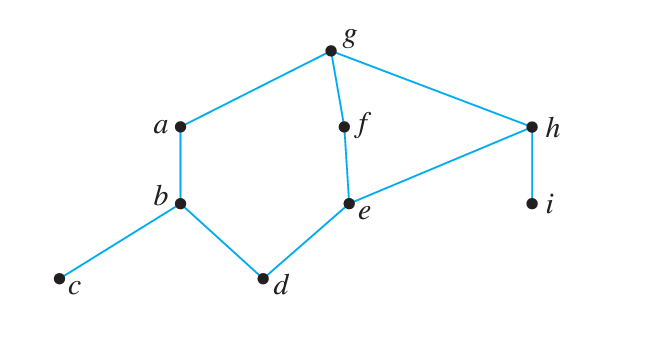
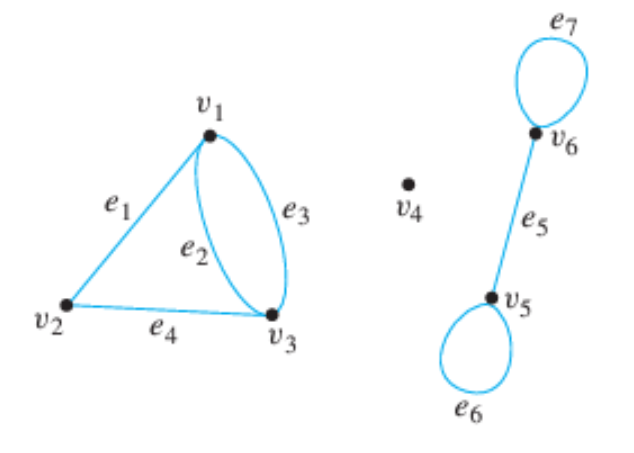
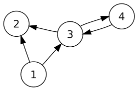
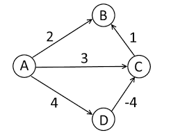
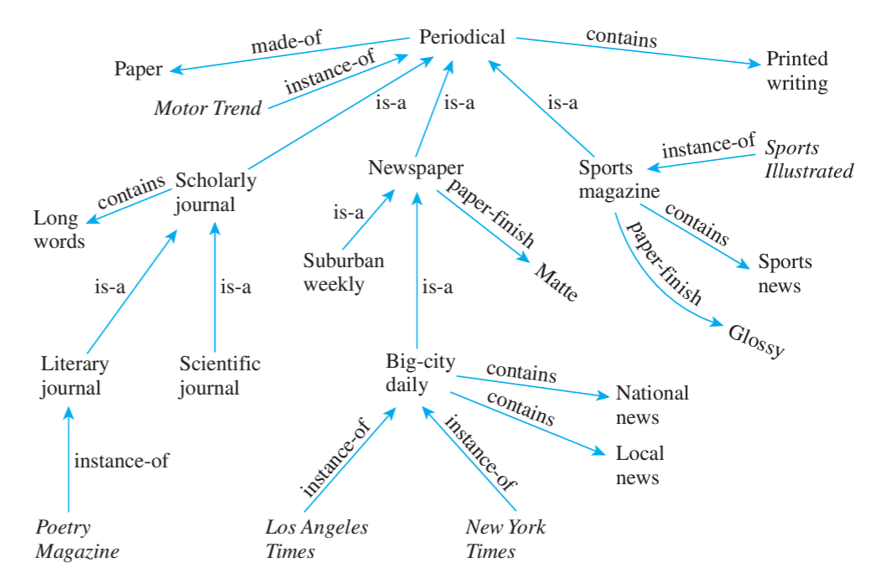
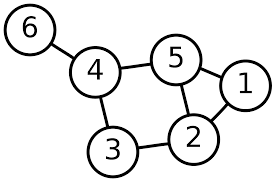

---
tags:
  - cs1200LN
date: {}
---
#cs1200LN
|  |  |  |  |
|----------|----------|----------|----------|
| [[CS1200|Home]] | [[CS1200 Calendar|Calendar]] | [[CS1200 Syllabus]] | [[Lecture Notes]] |


## Reminders

```query
cs1200task
where done = false
order by pos
limit 4
render [[template/topic]]
```

## Objectives

```query
task
where page = "CS1200 Calendar" and done = false
limit 3
order by pos
render [[template/topic]]
```
---

* [ ] PasswordManager program  📅2024-07-25 #cs1200task


# Graphs

#Definition A _graph_ **G** consists of two sets:
* A **Vertex Set** (**V(G)**) containing **Vertices/Nodes**
* An **Edge Set** (**E(G)**) relating elements of **V**


Each **edge** in **E** is associated with two vertices from **V** called **endpoints**

#Definition _graph terminology:_
* An edge **e** with endpoints **{v,w}** is said to be **incident on v** (and _incident on w_)
* Any two _vertices_ that are joined by an _edge_ are said to be **adjacent**
* Edges that share the same endpoints are called **parallel edges**
* An edge of the form _{v, v}_ where _v_ is some vertex is called a **loop**
* A Vertex that is not part of any edges is known as a **isolated vertex**

#DiscussionQuestion Identify any _parallel edges, loops, or isolated vertices_ in the graph below


---
#Definition The **degree** of a vertex **v** is the number of edges _incident_ on **v**

For the purposes of degree, a _loop_ **{v,v}** counts as two edges _incident_ on **v**

#Definition The **total degree** of a graph **G** is the sum of the degrees of all elements in **V(G)**

#DiscussionQuestion Consider any arbitrary graph with **|E(G)|** edges. Without drawing **G**, what is its _total degree_?

**2|E(G)|**

* [ ] Joseph S.  📅2024-07-19 #cs1200EC

---
#Definition Given two graphs, **H** and **G**, we say that **H** is a **subgraph of G** if and only if **V(H)** is a subset of **V(G)** and **E(H)** is a subset of **E(G)**

#BoardQuestion Draw all possible _subgraphs_ of the graph below


* [ ] Joseph S.  📅2024-07-19 #cs1200EC
* [ ] Brileigh  📅2024-07-19 #cs1200EC

---
## Directed & Weighted Graphs

#Definition In a **directed graph** (or **digraph**), the _edge-set_ _E(G)_ is replaced with a set of _directed edges_, **D(G)**

A _directed edge_, **d**, is associated with an element from **V(G) x V(G)**. That is, an ordered pair **(v,w)** where **v,w** are _vertices_ of **G**. In this case, **d** is the **directed edge from v to w**



_note:_
In some texts, all edges are directed and _undirected graphs_ are considered a special case where **D(G)** is _symmetric_

---

#Definition In a **weighted graph**, edges are further associated with a real-valued **weight**. 

Since edges are used to represent a relationship between the elements of **V(G)**, this weight can be used to express that some elements are _more related_ or _less related_ than others.




---
# Graph Representations

_What do vertices represent?_ **Anything**
_What do edges represent?_ **A relationship between anything and anything**
_What are graphs used for?_ 🤯 **ANYTHING!** 🤯

Graphs are a powerful tool used to represent any _relationship_ between elements of a set



_examples:_
* Communication in computer networks
* Travel-networks / road-systems
* Social networks
* Circuit design
* Outbreak of disease
* Water flow in plumbing systems
* Possible decision-making routes to goal condition

* [ ] kody  📅2024-07-19 #cs1200EC
* [ ] edward  📅2024-07-19 #cs1200EC

#DiscussionQuestion In the examples above, what would the _vertices_ represent? What would the _edges_ represent?

It’s important to remember for any _graph representation_ that what matters is the _logical relationship_ between vertices and **NOT** the visual depiction of the graph

In other words, a graph **G** is _uniquely identified_ by **V(G)** and **E(G)**

#BoardQuestion Label the vertices and edges in the two graphs below to demonstrate that they are in fact the same graph


---
# Special Types of Graphs

#Definition A graph containing any parallel edges is referred to as a **multigraph** 

#Definition A **simple graph** is graph with no _loops_ and no _parallel edges_


#DiscussionQuestion Do the following graphs exist? Draw an example if so

* A graph with 4 vertices of degree 1,1,2,3
* A graph with 4 vertices of degree 1,1,3,3
* A _simple graph_ with 4 vertices of degree 1,1,3,3

* [ ] Joseph  📅2024-07-19 #cs1200EC
* [ ] Brileigh  📅2024-07-19 #cs1200EC

---
#Definition A **complete graph** is one in which there is an edge **(v,w)** for every possible pairing of vertices **v,w**


#ChallengeQuestion Can you apply the techniques learned in [[Combinatorics & Probability]] to count the number of _subgraphs_ for a _complete graph_ of **n** vertices?
