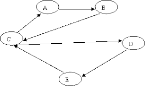

---
tags:
  - cs1200LN
date: {}
---
#cs1200LN
|  |  |  |  |
|----------|----------|----------|----------|
| [[CS1200|Home]] | [[CS1200 Calendar|Calendar]] | [[CS1200 Syllabus]] | [[Lecture Notes]] |


## Reminders

```query
cs1200task
where done = false
order by pos
limit 4
render [[template/topic]]
```

## Objectives

```query
task
where page = "CS1200 Calendar" and done = false
limit 3
order by pos
render [[template/topic]]
```
---

* [ ] Prob & Counting Quiz  📅2024-07-23 #cs1200task


---
#Definition In a **bipartite graph**, the vertices **V(G)** can be partitioned into two sets **U1, U2** such that no edge connects two elements of **U1** or two elements of **U2**


These graphs are often applied to _matching problems_ such as:
* Distributing tasks (**U1**) to employees (**U2**)
* Optimally pairing organ donors (**U1**) with compatible recipients (**U2**)
* Finding trading-sequences between sellers (**U1**) and buyers (**U2**) of various products

#Definition A **complete bipartite graph** is a _bipartite_ graph where every element of **U1** is _adjacent_ to every element of **U2**


* [ ] Joseph S.  📅2024-07-22 #cs1200EC

# Graph Walks

#Definition A **walk** is a finite alternating sequence of vertices and edges **{v_0, e_1, v_1, e_2, ... , e_k, v_k}** such that each edge **e_i** has endpoints **{v_(i-1), v_i}**

For a _multigraph_ (a graph that can contain _parallel edges_), it is often necessary to list both edges and vertices in the _walk-notation_

If _parallel edges_ are not present, then the notation can be shortened to omit either the edges or the vertices

#Definition A **trail** from **v** to **w** is a _walk_ with no repeated _edges_ starting at **v** and ending at **w**

#Definition A **path** from **v** to **w** is a _walk_ with no repeated _edges_ or _vertices_ starting at **v** and ending at **w**

#Definition A **closed walk** is a _walk_ which starts and ends at the same _vertex_

#Definition A **circuit** is a _closed walk_ containing at least one _edge_ and no repeated _edges_

#Definition A **simple circuit** is a _circuit_ with no repeated _vertex_ other than the start/end _vertex_

_Summary:_
| Type | Repeat edge | Repeat node | Same start/end | No edges |
|----------|----------|----------|----------|----------|
| Walk | allowed | allowed | allowed | allowed |
| Trail | not allowed | allowed | allowed | allowed |
| Path | not allowed | not allowed | not allowed | allowed |
| Closed Walk | allowed | allowed | required | allowed |
| Circuit | not allowed | allowed | required | not allowed |
| Simple Circuit | not allowed | start/end only | required | not allowed |

#DiscussionQuestion Consider the graph depicted below:

Are the following _walks_ also _trails, paths, circuits,_ or _simple circuits_?
```latex
v_1,e_1,v_2,e_3,v_3,e_4,v_3,e_5,v_4\\
e_1,e_3,e_5,e_5,e_6\\
v_2,v_3,v_4,v_5,v_3,v_6,v_2\\
v_2,v_3,v_4,v_5,v_6,v_2\\
v_1,e_1,v_2,e_1,v_1\\
v_1
```

* [ ] Brileigh  📅2024-07-22 #cs1200EC
* [ ] Joseph S.  📅2024-07-22 #cs1200EC
* [ ] Kody  📅2024-07-22 #cs1200EC
* [ ] Brileigh  📅2024-07-22 #cs1200EC
* [ ] Joseph S.  📅2024-07-22 #cs1200EC

## Connectivity in Graphs

#Definition An _undirected_ graph is **connected** if and only if there exists a _path_ between every possible pair of _vertices_

#DiscussionQuestion Which, if any, of the graphs depicted below are _connected_?


* [ ] Edward  📅2024-07-22 #cs1200EC
* [ ] Brileigh  📅2024-07-22 #cs1200EC
* [ ] Joseph S.  📅2024-07-22 #cs1200EC

There are three definitions of _connected_ used for _digraphs_:

#Definition A _digraph_ is **weakly connected** if the underlying _undirected_ graph (the graph with edge-directions removed) is _connected_

_example:_


#Definition A _digraph_ is **unilaterally connected** if for every pair of vertices _x, y_, there is either a _path_ from _x_ to _y_ OR there is a _path_ from _y_ to _x_

_example:_

#Definition A digraph is **strongly connected** if for every pair of vertices _x, y_, there is a _path_ from _x_ to _y_ AND there is a _path_ from _y_ to _x_ 

_example:_


_#KnowledgeCheck: Is the following graph:_
* **weakly connected, but not unilaterally connected**
* **unilaterally connected, but not strongly connected**
* **strongly connected**
* **none of the above**



* [ ] Austin  📅2024-07-22 #cs1200EC
* [ ] Drake  📅2024-07-22 #cs1200EC
