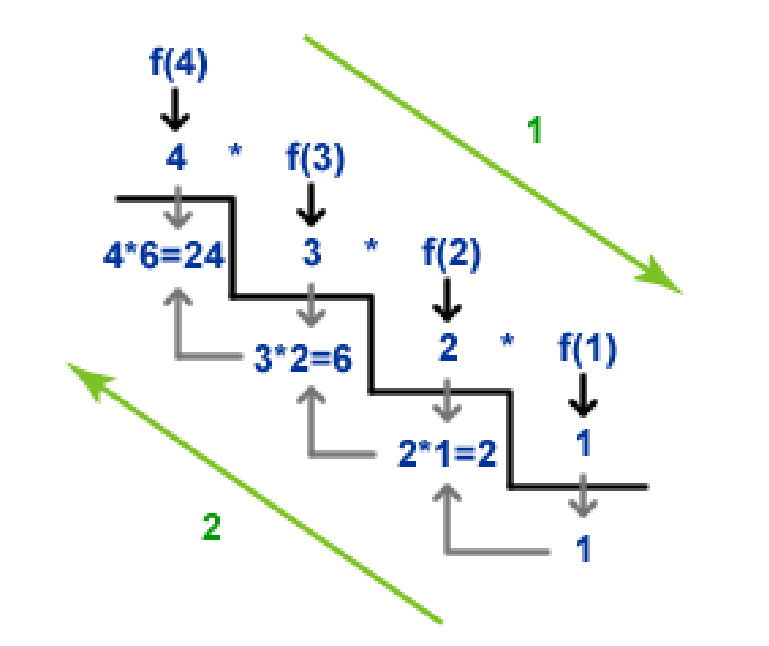

---
tags:
  - cs1575LN
date: {}
---
#cs1575LN
|  |  |  |  |
|----------|----------|----------|----------|
| [[CS1575|Home]] | [[CS1575 Calendar|Calendar]] | [[CS1575 Syllabus|Syllabus]] | [[Lecture Notes]] |


## Reminders

```query
cs1575task
where done = false
render [[template/topic]]
```

## Objectives

```query
task
where page = "CS1575 Calendar" and done = false
limit 3
order by pos
render [[template/topic]]
```
---


---
# Recursion as a Problem-Solving Tool

So why do we care? Well as computer scientists, our particular flavor of “problem-solving” revolves around simply giving a very careful and precise definition of the problem at hand. It may be unsurprising, therefore, that recursion is not only deeply ingrained into the theory of computer science, it is also a powerful tool to apply towards high-level problems.

In a recursive algorithm, we take the _global_ problem to be solved and formulate it in terms of smaller _sub-problems_ that are easier to solve but still have the same structure as the global. It relates to the classic problem-solving strategy of _Divide-and-Conquer_. 

A _recursive algorithm_ consists of the following components:
* **Base Case** - an instance of the problem that can be solved directly
* **Recursive Case** - a _Decomposition_ of the problem into smaller instances, along with a complete solution _Composed_ from the smaller solutions

Here, _smaller_ means that it must make some amount of progress toward a directly solvable _Base Case_

base^power

2^5

Let’s write a recursive algorithm for computing exponents
- What is our _Base Case(s)?_ **power = 0 ; return 1, power = 1 ; return base**
- What is our _Recursive Case(s)?_

base^power = base^(power-1) x base

**(even power)** base^power = base^(power/2) x base^(power/2)
**(odd power)** base^power = base^(power/2) x base^(power/2) x base
_note: integer division_
[[examples/recursion-exponentiation]]


---
# Tracing Recursion

It can be sometimes be difficult to envision where your code will go in a recursive algorithm, but we can easily keep track by remembering the call-stack.

This example uses the [[examples/recursion-exponentiation]] algorithm
```c++
int main()
{
  int n;
  n = recursive_exp(2, 7);
  std::cout<< n << std::endl;

  return 0;
}
```


Here is another example using a recursive _factorial_ algorithm:

```c++
int factorial(int n)
{
  if (n == 1 || n == 0) // Base Cases
    return 1;
  int solution = n * factorial(n-1); // Recursive Case
  return solution;
}
```



We can also think of execution with some helpful rules-of-thumb:

* Code _before_ a recursive call will resolve before anything else
* Code _after_ a recursive call will resolve only **after all recursive calls** have returned. This means that the return statement of the _initial_ call is actually be the _last_ to be executed.

#KnowledgeCheck Trace the execution of recursive_pow(2,65), how many total multiplications occur across all recursive calls? (do not try to calculate the value, just count the number of * operations)

2^65
2^32 * 2^32 * 2
2^16 * 2^16
2^8 * 2^8
2^4 * 2^4
2^2 * 2^2
2^1 * 2^1
2

* [ ] william  📅2024-07-05 #cs1575EC
* [ ] raylynn  📅2024-07-05 #cs1575EC

O(lg(n))

* [ ] william  📅2024-07-05 #cs1575EC

---
# Classifying Recursion

Recursion can come in several forms:

* Linear - Single recursive call made per non-base case

* Multiple - Two or more (branching) recursive calls made 

* Indirect - FuncA() calls FuncB(), calls FuncA(), calls FuncB() ...


---
# A Blueprint for Recursive Algorithms

In general, all recursive algorithms follow the same basic structure:

```
recursive_function(X):

  if X is a base case:
    return solution_X

  else:
    Decompose(X) -> {x1, x2, ..., xn}
    solution_1 <- recursive_function(x1)
    solution_2 <- recursive_function(x2)
    ...
    solution_n <- recursive_function(xn)

    solution_X <- Compose(solution_1, solution_2, ..., solution_n)
    return solution_X
```

Of course, _n_ is often just 1 or 2 and the process of _Decompose()_ and _Compose()_ can take on many forms.

### The Tower of Hanoi

This is a very famous game involving moving stacks of increasingly sized rings around 3 or more pegs [Try it youself](http://towersofhanoi.info/Play.aspx)

It is a topic that has long inspired mathematicians and computer scientists alike as a very elegant example of the _magic_ of recursion.
Let’s tackle the challenge of writing an algorithm to produce a list of moves to solve the Tower of Hanoi

[[Tower of Hanoi]]
