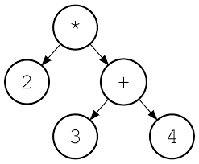

---
tags:
  - cs1575LN
date: {}
---
#cs1575LN
|  |  |  |  |
|----------|----------|----------|----------|
| [[CS1575|Home]] | [[CS1575 Calendar|Calendar]] | [[CS1575 Syllabus|Syllabus]] | [[Lecture Notes]] |


## Reminders

```query
cs1575task
where done = false
render [[template/topic]]
```

## Objectives

```query
task
where page = "CS1575 Calendar" and done = false
limit 3
order by pos
render [[template/topic]]
```
---

* [ ] [[PA04]]  📅2024-07-17 #cs1575task
* [x] Quiz 4  📅2024-07-15 #cs1575task

There are many ways of defining the properties of Trees, but for this class we are most interested in their _recursive_ structure.

  * a single node is a tree
  * two trees joined by a single edge is also a tree

What does this tell us? _Any_ node in a tree forms a **sub-tree** with its descendants... recursion ensues!

# Applications for Trees

**Expression trees**



2*(3+4)


**File systems**


**Data structures & Algorithms!**

_honorable mentions:_ parse trees(Theory), spanning trees(Networks), decision trees(AI)

# Trees and Data Structures

Instead of a _linear ordering_ of the data like that of the _sequence-based_ abstract data types we’ve seen before (stack, queue, list), tree-based ADT make use of a _hierarchical_ relationship. 

It is common to define a general-purpose _Tree_ Abstract Data Type for interacting with data that has an inherent hierarchical structure (see: Applications for Trees). For this course, however, we will focus on _Tree-inspired_ ADT and Data Structures that can be applied to any collection of data but utilize a hierarchy for efficiency purposes

## Working with unordered data

Because there is no linear ordering to a tree, we need to devise algorithms for _enumerating_ the data whenever we want to traverse through it. There are a number of ways to do this and each one gives us a different _order_. 

[[examples/pre-order-traversal]]

* [ ] brileigh  📅2024-07-10 #cs1575EC
* [ ] raylynn  📅2024-07-10 #cs1575EC

[[examples/post-order-traversal]]


You can experiment with these algorithms for binary trees [here](https://tree-visualizer.netlify.app/)

## Special Trees

A tree for optimizing _search/find_ operations
[[BST]]

A tree for optimizing _getMax/getMin_ operations
[[Heaps]]

# Binary Search Trees

A BST is a **binary tree** that possesses the **search property**

* A binary tree is one in which every node has _at most_ 2 children
  * We will refer to these children as the **left-subtree** and **right-subtree**
* The _search property_ means that:
  * Every node is **comparable** with every other node and **no duplicates** are allowed
  * For any given node _N_,
    * _N_ is _lesser than_ every node in the _right-subtree_
    * _N_ is _greater than_ every node in the _left-subtree_


a < b
a > b
a == b

_#KnowledgeCheck: Which of the following are valid Binary Search Trees?_


* [ ] raylynn  📅2024-07-10 #cs1575EC
---


---


* [ ] raylynn  📅2024-07-10 #cs1575EC

The primary benefit of designing data structures that maintain these properties is that it allows for efficient searching of the data by use of the [[examples/runtime-logarithm|Binary Search]] algorithm.
