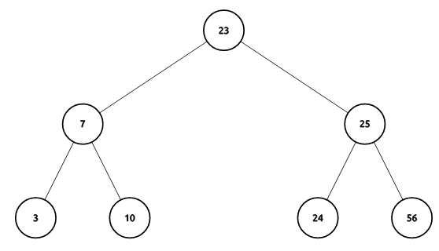

---
tags:
  - cs1575LN
date: {}
---
#cs1575LN
|  |  |  |  |
|----------|----------|----------|----------|
| [[CS1575|Home]] | [[CS1575 Calendar|Calendar]] | [[CS1575 Syllabus|Syllabus]] | [[Lecture Notes]] |


## Reminders

```query
cs1575task
where done = false
render [[template/topic]]
```

## Objectives

```query
task
where page = "CS1575 Calendar" and done = false
limit 3
order by pos
render [[template/topic]]
```
---

# The Priority Queue Abstract Data Type

A Priority Queue is a collection of data, together with a _function_ mapping each element to its _priority_.

{ <val1>, <val2>, ... , <val_n> }

A Priority Queue differs from the standard Queue ADT follows a strategy where only the element with the **highest priority** is accessible. Since elements can be added to a Priority Queue in any order, a [[Heaps|Heap]] structure is most often used to organize the elements and avoid expensive searching for the highest priority.

## Operations

* getMax(PQ) -> the element of PQ with highest priority
* enqueue(PQ, value) -> PQ’ with new element _value_
* dequeue(PQ) -> PQ’ with highest priority element removed


---


# Priority Queue Data Structures

## C++ standard library implementations:
  * [std::priority_queue](https://en.cppreference.com/w/cpp/container/priority_queue)

## Our Implementations:

[[BinaryHeap]]

# Properties of Heaps

A heap is a **complete tree** that possesses the **heap property**. A complete tree is one in which every _level_ of the tree except the last level is completely full and the last level is partially filled from ==left to right==.

Though a heap does not have to be a binary tree, binary heaps are widely studied.

The **min-heap property** means that given any node _N_ in the tree, _N_ is _lesser than_ all of its descendants. In a min-heap, the root node is the minimum element.

The **max-heap property** means that given any node _N_ in the tree, _N_ is _greater than_ all of its descendants. In a max-heap, the root node is the maximum element.

#KnowledgeCheck: Which of the following are valid heaps?



* [ ] raylynn  📅2024-07-18 #cs1575EC

---

* [ ] brileigh  📅2024-07-18 #cs1575EC
* [ ] william  📅2024-07-18 #cs1575EC


---


An interesting property of heaps is that they provide a **partial ordering** of the data. In informal terms, this simply means that not all elements are directly _comparable_ (nodes that are neither ancestor nor descendant are incomparable), but comparisons among elements is _transitive_ (if a > b && b > c then a > c). 

This matters because for use in a priority queue, we care only about the maximum/minimum element. A partial ordering like that of a heap is cheaper to maintain than a **total ordering** that would be given by a fully sorted collection.

[1, 4, 6, 7, 8, 9]

12
O(n)

# Building a Heap

You can view visualizations for these [here](http://btv.melezinek.cz/binary-heap.html)

## Adding nodes

* [ ] brileigh  📅2024-07-18 #cs1575EC
* [ ] raylynn  📅2024-07-18 #cs1575EC

DQ: 
* How to satisfy the _complete-tree_ property?
* How to satisfy the _heap_ property?

```
Enqueue-Heap(x): (min-heap)

  place x at left-most open spot in the bottom level

  while ( x < x.parent )
    swap x with x.parent

```

## Removing nodes

DQ: 
* Which node would we want to remove (for a priority queue)?
* How to satisfy the _complete-tree_ property?
* How to satisfy the _heap_ property?

* [ ] raylynn  📅2024-07-18 #cs1575EC

```
Dequeue-Heap(): (min-heap)

  replace root value with rightmost value of the bottom level (new_root)

  while ( new_root < children  )
    swap new_root with min_child

```

