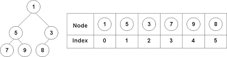

---
tags:
  - cs1575LN
date: {}
---
#cs1575LN
|  |  |  |  |
|----------|----------|----------|----------|
| [[CS1575|Home]] | [[CS1575 Calendar|Calendar]] | [[CS1575 Syllabus|Syllabus]] | [[Lecture Notes]] |


## Reminders

```query
cs1575task
where done = false
render [[template/topic]]
```

## Objectives

```query
task
where page = "CS1575 Calendar" and done = false
limit 3
order by pos
render [[template/topic]]
```
---

* [ ] [[PA05]]  📅2024-07-24 #cs1575task


# The Priority Queue Abstract Data Type

A Priority Queue is a collection of data, together with a _function_ mapping each element to its _priority_.

{ <val1>, <val2>, ... , <val_n> }

A Priority Queue differs from the standard Queue ADT follows a strategy where only the element with the **highest priority** is accessible. Since elements can be added to a Priority Queue in any order, a [[Heaps|Heap]] structure is most often used to organize the elements and avoid expensive searching for the highest priority.

## Operations

* getMax(PQ) -> the element of PQ with highest priority
* enqueue(PQ, value) -> PQ’ with new element _value_
* dequeue(PQ) -> PQ’ with highest priority element removed

# Properties of Heaps

A heap is a **complete tree** that possesses the **heap property**. A complete tree is one in which every _level_ of the tree except the last level is completely full and the last level is partially filled from left to right.

Though a heap does not have to be a binary tree, binary heaps are widely studied.

The **min-heap property** means that given any node _N_ in the tree, _N_ is _lesser than_ all of its descendants. In a min-heap, the root node is the minimum element.

The **max-heap property** means that given any node _N_ in the tree, _N_ is _greater than_ all of its descendants. In a max-heap, the root node is the maximum element.

# Building a Heap

You can view visualizations for these [here](http://btv.melezinek.cz/binary-heap.html)


## _Heapifying_ existing collection

DQ:
* How might we convert a random tree into a heap?
* Is this better than repeated insertions?

```
Sift-Down(x): (max-heap)

  while (x < child)
    swap x with max-child


Heapify collection by applying Sift-Down to each node, starting from the bottom
```


# Heaps and Data Structures

Even though logically a heap represents a tree structure, implementations of heaps most commonly make use of an array to store elements. This is an efficient choice because of the assumption that heaps are _complete_. 

To represent a heap using an array, we use a _level-ordering_ of the nodes. That is, we assign indices to nodes from top-to-bottom and left-to-right.



* [ ] raylynn  📅2024-07-19 #cs1575EC

It is possible to make an array-based representation for any arbitrary tree, but it would require us to allocate empty space in the array for any missing nodes that would otherwise be present in a complete tree.

## Indexing Schemes

Given the i-th element of a binary heap (the element at index i),

Can you give a formula for the following?

  *  index of left-child : 2*i + 1
  *  index of right-child : 2*i + 2
  *  index of parent : (i-1)/2 (round down)

* [ ] brileigh  📅2024-07-19 #cs1575EC

Challenge: Can you generalize these for heaps of degree 3 or degree n?

This gives us the ability to navigate our array-based heap in the same way that we would a tree-based heap implementation. Instead of following the edges of a tree, we simply apply the appropriate formula to our current array-index.

## C++ implementation for Binary Heap
  [[BinaryHeap]]

# Class & Diagram

[[examples/binheap-class]]
```c++
template <typename T>
class MaxBinaryHeap : public ArrayList<T>
{
  private:
    void siftDown(int start_index);
  public:
    void push(const T& val);
    void pop();
    const T& top();
}
```


The fast random-access provided by an [[ArrayList]] is sufficient for implementing a heap/priority-queue.

_Note:_
In the c++ standard library, inheritance is not used to create a priority queue from existing structures. A concept known as _adapters_ are used instead. See https://en.cppreference.com/w/cpp/container for reference

---
# Operations

## GetMax (top)
[[examples/binheap-top]]

* [ ] brileigh  📅2024-07-19 #cs1575EC
* [ ] raylynn  📅2024-07-19 #cs1575EC

## Sift-down
[[examples/binheap-siftdown]]

* [ ] raylynn  📅2024-07-19 #cs1575EC
