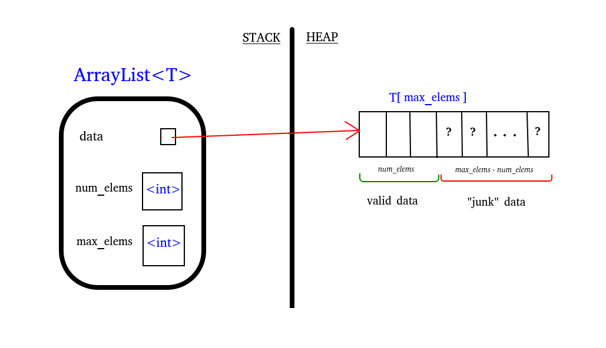

#cs1575LN
|  |  |  |  |
|----------|----------|----------|----------|
| [[CS1575|Home]] | [[CS1575 Calendar|Calendar]] | [[CS1575 Syllabus|Syllabus]] | [[Lecture Notes]] |


## Reminders

```query
cs1575task
where done = false
render [[template/topic]]
```

## Objectives

```query
task
where page = "CS1575 Calendar" and done = false
limit 3
order by pos
render [[template/topic]]
```
---

# ArrayList Class & Diagram

The key idea behind the ArrayList/Vector is to use a dynamically-allocated _storage array_ that can be re-sized as necessary

[[examples/arraylist-class]]





---

# Operations (member functions)


## Erase

[[examples/arraylist-erase]]


## Find

[[examples/arraylist-find]]


---

# Default Member Functions

## Destructor

[[examples/arraylist-destructor]]

## Operator=

[[examples/arraylist-assign-op]]

## Copy Constructor

[[examples/arraylist-copy-constructor]]

* [ ] [[PA02]]  📅2024-09-30 #cs1575task
