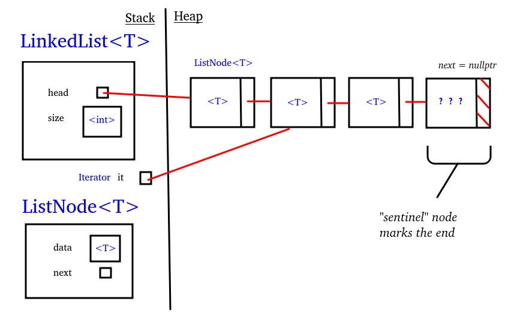

#cs1575LN
|  |  |  |  |
|----------|----------|----------|----------|
| [[CS1575|Home]] | [[CS1575 Calendar|Calendar]] | [[CS1575 Syllabus|Syllabus]] | [[Lecture Notes]] |


## Reminders

```query
cs1575task
where done = false
render [[template/topic]]
```

## Objectives

```query
task
where page = "CS1575 Calendar" and done = false
limit 3
order by pos
render [[template/topic]]
```
---


This allows us to classify functions by their simple-and-easy-to-work-with equivalents, giving rise to the _Complexity Hierarchy_

| Complexity | Name |
|----------|----------|
| n! | factorial |
| 2^n | exponential |
| ... | ... |
| n^a | polynomial |
| n^3 | cubic |
| n^2 | quadratic |
| n*log(n) | linearithmic |
| n | linear |
| log(n) | logarithmic |
| 1 | constant |

Every runtime function is Θ to only one layer of the hierarchy, and each layer represents dramatically better performance than those that come above it. 

From the formal definition of Big-O and Big-theta, we can prove some useful theorems that we can use to map a large, unruly function into its place in the complexity hierarchy. 

If T1(n) is O(f(n)) and T2(n) is O(g(n)), then:
* T1(n) + T2(n) is O( max(f(n), g(n)) )
* T1(n) * T2(n) is O( f(n)*g(n) )

And from those theorems:
* A polynomial of degree k is O( n^k )

**Note: The theorems above also work for big-Θ**

---
## Complexity & Data Structures

For the following comparison, assume that both lists accept a ListIterator to access data with operations:
* prev() - move to previous data element
* next() - move to next data element
* moveTo(i) - move to element i

For get, insert, erase, assume that you have a valid ListIterator

| Operation | ArrayList | LinkedList |
|----------|----------|----------|
| get | O(1) | O(1) |
| prev | O(1) | O(n) |
| next | O(1) | O(1) |
| moveTo | O(1) | O(n) |
| insert | O(n) | O(1) |
| erase | O(n) | O(1) |



What conclusions can you draw about which list to use?

_#KnowledgeCheck:
Fill in the table above for a Doubly-LinkedList. A Doubly-LinkedList uses nodes that store the memory address of the next and the previous node_

---


In this section we’ll see how some limited, minimal data structures can still be a powerful tool. We’ll also see how having fewer operations can lead to enhanced performance through clever engineering

# Stacks

## The Abstract Data Type Stack

A stack is a _sequence_ of elements of the same type

One end of the sequence is designated the _top_. A stack follows a strategy of _first-in, last-out_ (FILO) where the newest data in the sequence is always the first to be removed.

### Operations:

_Let S1 = **top ->** < a, o, e, u, i >_
* top(S) -> the top element of S
  * top(S1) -> a
    
* push(S, x) -> S’ with new top element, x
  * push(S1, y) -> < y, a, o, e, u, i >
    
* pop(S) -> S’ with top element removed
  * pop(S1) -> < o, e, u, i>

## Applications for Stacks

**The Matching Brackets Problem**

Consider the problem of parsing a written program and determining if a given line is a valid expression or not. If your language supports nested expressions with brackets () [] {}, then you may need to verify that these brackets are used appropriately.

An expression is invalid if:
* an opening bracket ( [ { does not have a matching closing bracket
* a closing bracket ) ] } does not have a matching opening bracket
* the string in-between a pair of matching brackets is an invalid expression

How might you use a stack to efficiently validate an expression?

use stack to store _opening brackets_

go through the characters of the string **c**
  * If c is opening, push to stack
  * If closing, compare to top of stack
    * if they match, pop the stack
    * if not, return INVALID
check the stack
  * if empty, return VALID
  * if not, return INVALID


Test your solution on the following expressions:
* ```a(b)[cd]```
* ```(b[)ef]```
* ```({x}```
* ```([a{b]c)}```

**The Call Stack**

C++ actually uses a stack for a very important purpose, and if you’re familiar with using a debugger you’ve probably viewed it yourself. The call stack allows your program to efficiently change scope when calling a function and resume execution where it left off after the function returns.
