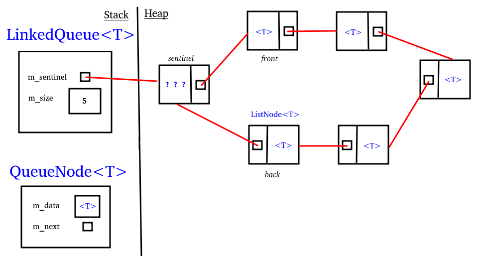

#cs1575LN
|  |  |  |  |
|----------|----------|----------|----------|
| [[CS1575|Home]] | [[CS1575 Calendar|Calendar]] | [[CS1575 Syllabus|Syllabus]] | [[Lecture Notes]] |


## Reminders

```query
cs1575task
where done = false
render [[template/topic]]
```

## Objectives

```query
task
where page = "CS1575 Calendar" and done = false
limit 3
order by pos
render [[template/topic]]
```
---


# Queues

## The Abstract Data Type Queue

A queue is a _sequence_ of elements of the same type

One end of the sequence is designated as the _front_, the other is the _back_. A queue follows a _first-in, first-out_ (FIFO) strategy where the data that has been in the sequence the longest is always the first to be removed.

### Operations:

_Let Q1 = < a, o, e, u, i >_
* front(Q) -> the front element of Q
  * front(Q1) -> ?
    
* enqueue(Q, x) -> Q’ with new back element, x
  * enqueue(Q1, y) -> ?
    
* dequeue(Q) -> Q’ with front element removed
  * dequeue(Q1) -> ?

## Applications for Queues

* Scheduling problems
* Control of Peripherals
* Simulations
* etc.

## Queue Data Structures

[[ArrayQueue]]
[[LinkedQueue]]


Consider the following queue:

 **< a0, a1, a2, ... , an >**

Can [[ArrayList]] operations efficiently implement _front, enqueue, dequeue?_ 

## Case 1 (sequence-order)

  _front_ -> **< a0, a1, a2, ... , an >** <- _back_

**Front** O(1)

**Enqueue** O(1)*

**Dequeue** O(n)


## Case 2 (reverse sequence-order)

  _back_ -> **< a0, a1, a2, ... , an >** <- _front_

**Front** O(1)

**Enqueue** O(n)

**Dequeue** O(1)


Either way requires shifting elements... _or does it..._ enter the _circular array_

---

## Circular Array


[[examples/arrayqueue-class]]
```c++
#define MIN_CAPACITY 4
template <typename T>
class ArrayQueue
{
  private:
    int front;      // index-of start of valid data
    int back;       // index-of next available space   
    int max_elems;   // length of storage array
    int num_elems;       // # of valid data elements
    T *data;        // pointer to storage array
    void resize(int new_capacity);
  public:
    ArrayList() : front (0), back (0), max_elems (MIN_CAPACITY) 
                { data = new T[max_elems]; } // default constructor

    //OPERATIONS
    T& front();
    void enqueue(const T& value);
    void dequeue();
};
```


[Visualization](https://www.cs.usfca.edu/~galles/visualization/QueueArray.html)


[[examples/arrayqueue-ops]]


## LinkedQueue

Consider the following queue:

   **< a0, a1, a2, ... , an >** 

Can [[LinkedList]] operations efficiently implement _front, enqueue, dequeue?_ 

How might we re-engineer the LinkedQueue to make all 3 operations into constant-time algorithms?

[[examples/linkedqueue-class]]



[[examples/linkedqueue-ops]]