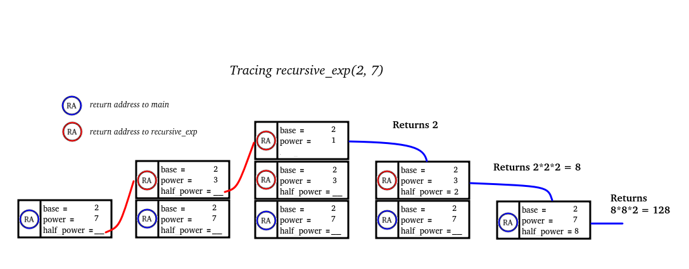

#cs1575LN
|  |  |  |  |
|----------|----------|----------|----------|
| [[CS1575|Home]] | [[CS1575 Calendar|Calendar]] | [[CS1575 Syllabus|Syllabus]] | [[Lecture Notes]] |


## Reminders

```query
cs1575task
where done = false
render [[template/topic]]
```

## Objectives

```query
task
where page = "CS1575 Calendar" and done = false
limit 3
order by pos
render [[template/topic]]
```
---

# What is Recursion

Click here for an explanation: [[Recursion]]


Just kidding. Recursion is a means of mathematical definition in which one or more components or properties of an object are defined ==in terms of the object itself==.

For example, suppose you’ve been tasked with formally defining the set of natural numbers to a room of very uptight mathematicians. 
You might give the answer:
  _1, 2, 3, 4, ..._
But this isn’t good enough for the mathematicians, you just gave some examples not a formal description!

You might try again with something like:
  _A natural number is a positive number without decimals_
While this is true of all natural numbers, the crowd still won’t be satisfied unless you define the words _positive_ and _decimal_! 🤓

You finally decide to use a **recursive definition**:
  * 1 is a natural number
  * _n > 1_ is a natural number if and only if _n-1_ is a natural number
And the mathematicians nod in approval

_Recursion_ is a means of defining something in terms of itself.

Every recursive definition will have two components:
* One or more **Base Cases** - statements that give a direct answer/result
* One or more **Recursive Cases** - statements that give an indirect answer in ==terms of the object in question==

---
# Recursion as a Problem-Solving Tool

So why do we care? Well as computer scientists, our particular flavor of “problem-solving” revolves around simply giving a very careful and precise definition of the problem at hand. It may be unsurprising, therefore, that recursion is not only deeply ingrained into the theory of computer science, it is also a powerful tool to apply towards high-level problems.

In a ==recursive algorithm==, we take the _global_ problem to be solved and formulate it in terms of smaller _sub-problems_ that are easier to solve but ==still have the same structure as the global==. It relates to the classic problem-solving strategy of _Divide-and-Conquer_. 

A _recursive algorithm_ consists of the following components:
* **Base Case** - an instance of the problem that can be solved directly
* **Recursive Case** - ==a _Decomposition_ of the problem== into smaller instances, along with a ==complete solution _Composed_== from the smaller solutions

Here, _smaller_ means that it must make some amount of progress toward a directly solvable _Base Case_

Let’s write a recursive algorithm for computing exponents
- What is our _Base Case(s)?_
- What is our _Recursive Case(s)?_
  
[[examples/recursion-exponentiation]]


---
# Tracing Recursion

It can be sometimes be difficult to envision where your code will go in a recursive algorithm, but we can easily keep track by remembering the call-stack.

This example uses the [[examples/recursion-exponentiation]] algorithm
```c++
int main()
{
  int n;
  n = recursive_exp(2, 7);
  std::cout<< n << std::endl;

  return 0;
}
```


Here is another example using a recursive _factorial_ algorithm:

```c++
int factorial(int n)
{
  if (n == 1 || n == 0) // Base Cases
    return 1;
  int solution = n * factorial(n-1); // Recursive Case
  return solution;
}
```


We can also think of execution with some helpful rules-of-thumb:

* Code _before_ a recursive call will resolve immediately
* Code _after_ a recursive call will resolve only **after all subsequent recursive calls** have returned. This means that the return statement of the _initial_ call is actually be the _last_ to be executed.

#KnowledgeCheck Trace the execution of recursive_pow(2,65), how many total multiplications occur across all recursive calls? (do not try to calculate the value, just count the number of * operations)
e recursive algorithms are often interchangeable with their iterative counterparts.
