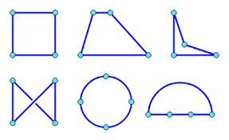

# Graph Representations

_What do vertices represent?_ **Anything**
_What do edges represent?_ **ANYTHING**
_What are graphs used for?_ 🤯 **ANYTHING!** 🤯

Graphs are a powerful tool used to represent any _relationship_ between elements of a set

_examples:_
* _Social media graph_ ; **V** - Users ; **E {v,w}** - _v_ and _w_ are friends
* _Roadmap graph_ ; 

